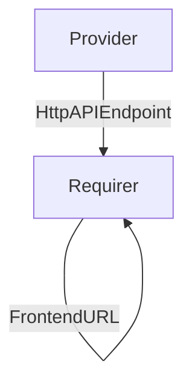

# `litmus_backend_http_api`

## Usage

This is an internal interface for the litmus chaos testing solution, meant for the backend component to communicate its http API endpoint to the chaoscenter frontend component, and the chaoscenter application to give to the backend a frontend URL in return.

## Direction

This interface implements a provider/requirer pattern, where the backend **provides** a service to the chaoscenter component.



## Behavior

### Provider

- Must provide to the requirer a full cluster-internal (the solution does not support being distributed cross-model/controller) http(s) url of a litmus backend component (also known as 'graphql server'|'chaoscenter' in upstream docs) server. 
    

### Requirer

- Must provide to the requirer a full cluster-internal (the solution does not support being distributed cross-model/controller) http(s) url of a litmus frontend component server. 
    

## Relation Data

[\[Pydantic Schema\]](./schema.py)

#### Example
```yaml
provider:
  app: {
         version: 0,
         endpoint: "http://foo.com:2025/"
  }
  unit: {}
requirer:
  app: {
         version: 0,
         endpoint: "http://bar.com:8080/"
  }
  unit: {}
```
