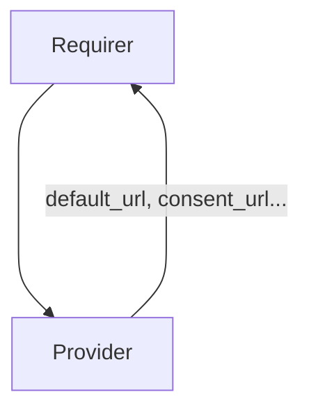

# `login_ui_endpoints`

## Overview

This relation interface describes the expected behavior of charms claiming to be able to provide or consume Identity Platform Login UI endpoints.

## Usage

The interface will provide publicly accessible endpoints. These endpoints include the URL intended as the default for browsers, as well as specific endpoints for the Ory Hydra and Kratos applications.

## Endpoints

The full list of endpoints provided by login_ui_endpoints provider is the following:
- consent_url
- error_url
- index_url
- login_url
- oidc_error_url
- registration_url
- default_url

## Direction

The interface will consist of a provider and a requirer. The provider is expected to supply its endpoints,
while the requirer will just read the information from the application databag. For the full list of endpoints, please refer to the Endpoints section.

## Behavior

Both the requirer and the provider need to adhere to a certain set of criteria to be considered compatible with the interface:

### Provider

- Is expected to serve Identity Platform Login UI endpoints.
- Is expected to write the URLs to the application databag.

### Requirer

- Is expected to consume the relation data to set up integration with Identity Platform Login UI endpoint.

## Relation Data

[\[Pydantic Schema\]](./schema.py)
