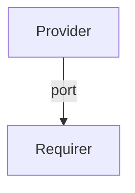

# `milter`

## Overview

This relation interface specification describes the expected behavior of charms integrating over the `milter` Juju interface to provide or consume a mail filter (milter).

## Usage

In most cases, this will be accomplished by manually parsing the relation data, given its simple nature.

## Direction

The `milter` interface implements a provider/requirer pattern.
The requirer is a charm that requires Milter details to connect to a Milter server, and the provider is a charm serving as Milter.



## Behavior

The requirer and the provider must adhere to a certain set of criteria to be considered compatible with the interface.

### Provider

- Is expected to provide the Milter port so that the requirer can connect.

### Requirer

- Is not expected to publish anything
- Is expected to combine the provided milter port with the provider's `ingress-address` to connect

## Relation Data

### Provider

[\[Pydantic Schema\]](./schema.py)

Provider publishes the Milter configuration. It should be placed in the **unit** databag.

#### Example

```yaml
# application_data: <empty>
unit_data:
  port: 8892
```
