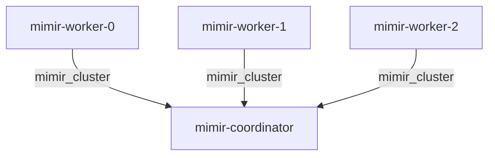

# `mimir_cluster`

## Usage

This relation interface describes the protocol for communication between the `mimir-coordinator-k8s` charm and the `mimir-worker-k8s` charm. The interface is only intended to be used between these two charms.

## Direction

The `mimir_cluster` interface implements a provider/requirer pattern.
The provider is `mimir-coordinator-k8s` and the requirers are `mimir-worker-k8s`.



## Behavior

The requirer and provider should provide specific information to facilitate the running of Mimir.

### Provider

- Is expected to provided a working configuration file for the mimir workers to use.

### Requirer

- Provide information about how to access the node api endpoints of the worker application.
- Provide juju topology information for the worker nodes.
- Specify which roles the worker application will run with.

## Relation Data

[\[Pydantic Schema\]](./schema.py)
All fields are json-serialized.

#### Example
```yaml
provider:
  app: {<python object representing mimir config>}
requirer:
  app: {"roles": ["read"]}
  unit:
    juju_topology:
      unit: "worker/0"
      app: "worker"
      charm: "mimir-worker-k8s"
      model: "cos"
      model_uuid: "<uuid of model>"
    address: "hostname"
    port: 12345
    scheme: "http"
```
