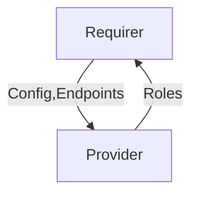

# `mimir_worker`

## Usage

This relation interface is used by [the Mimir Coordinator charm](/url) and [the Mimir Worker charm](/url) to exchange Mimir Configuration data.


## Direction

This interface implements a provider/requirer pattern: the provider is the Worker and the requirer is the Coordinator.



## Behavior
### Provider

- Is expected to communicate which roles it has
- Is expected to accept any configuration provided by the Coordinator and comply with it as if it came from juju-config 
    

### Requirer

- Is expected to communicate to each worker node:
  - a mapping from unique identifiers to component roles and URLs
  - what their current configuration should be
  - what endpoint(s) to push telemetry to

## Relation Data

Describe the contents of the databags, and provide schemas for them.

[\[Pydantic Schema\]](./schema.py)

#### Example
Provide a yaml/json example of a valid databag state (for the whole relation).
```yaml
requirer:  # Worker
  app: 
    roles: ['alertmanager']
    
  unit:
    juju_topology: 
      model: modelname
      unit: alertmanager/0
      # ...

  
provider:  # Coordinator
  app:
    hash_ring:  # json-encoded
      - 42.42.42.43  # alertmanager/0
      - 42.42.42.44  # ingester/1
      - ... # for all components
         
    s3_storage:  # json-encoded
      - url: "foo"
      - endpoint: "bar"
      - access_key: "bar"
      - insecure: false
      - secret_key: "x12"
    
    config: str  # a big json-encoded data structure
  
  unit: {}
```
