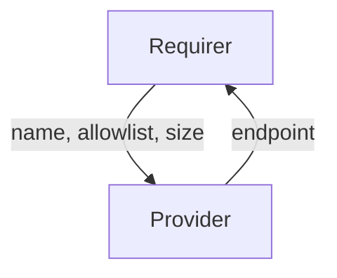

# `nfs_share`

## Overview

This integration interface describes the expected behavior of any charm
claiming to be able to interface with an NFS share provider or consumer.

## Usage

Charmed operators claiming to provide this interface must implement and
support the [Network File System (NFS)](https://datatracker.ietf.org/doc/html/rfc5661)
protcol. Providing charmed operators should support exporting NFS share
endpoints while Requiring charms should support mounting NFS shares. In most cases, 
communication between Providers and Requirers will be accomplished using the 
[nfs_interfaces](https://charmhub.io/storage-libs/libraries/nfs_interfaces) library,
however, charm developers are free to provide alternative libraries such that they
fulfill the behavioral and schematic requirements described in this document.

## Direction

The `nfs_share` interface implements a provider/requirer pattern. The consumer is a 
charm that wishes to act as an NFS client with the ability to mount exported NFS shares. 
The provider is a charm exposing an NFS share endpoint, and does not need to be an NFS 
server itself. The provider can be a proxy that exports an NFS share endpoint from a 
non-charmed NFS storage appliance.



## Behavior

The Provider and the Requirer must adhere to a certain set of criteria to be considered
compatible with the interface.

### Provider

- Is expected to publish an NFS Uniform Resource Locator in its application databag as
  share endpoint. The endpoint is expected to have the following structure:
    
    > `nfs://[ingress hostname/address]:[port number]/[path to NFS share]`

  Port number is not required in the URL as almost all NFS implementations automatically
  negotiate the port number, packet size, transport protocol, and NFS version to use.

### Requirer

- Is expected to publish a name/alias that can be used as a unique identifier
  for a requested NFS share in its application databag.
- Is expected to optionally publish a size, in gigabytes (GB), for how large to make a 
  requested NFS share in its application databag.
- Is expected to optionally publish an allowlist of hostnames that should be granted 
  read/write access to the requested NFS share.

## Relation Data

### Provider

Provider provides its NFS share endpoints. The NFS share endpoints should be placed in the
__application__ databag.

#### Example

```yaml
application_data: {
  endpoint: "nfs://10.152.28.100/volumes/polaris-research-data"
}
```

### Requirer

#### Example

```yaml
application-data: {
  name: "/polaris-research-data",
  size: "100",
  allowlist: "192.168.0.15/24,10.152.28.100/24,"
}
```
