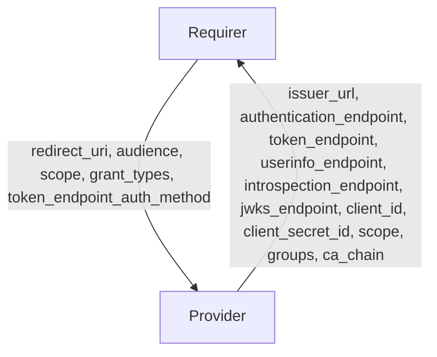

# `oauth_client`

## Usage

This relation interface describes the expected behavior of any charm claiming to be able to interface with an OAuth2/OIDC Provider. Charms claiming to provide this interface must implement the OAuth2/OIDC protocol and register a client for each relation.

In most cases, this will be accomplished using the oauth_client library, although charm developers are free to provide alternative libraries as long as they fulfill the behavioral and schematic requirements described in this document.

## Direction

The `oauth_client` interface implements a provider/requirer pattern.
The consumer is a charm that wishes to act as a oauth2 client, and the provider is a charm exposing an OAuth2/OIDC provider.



## Behavior

The requirer and the provider MUST adhere to a certain set of criteria to be considered compatible with the interface.

### Provider

- MUST provide its endpoints(authentication_endpoint, token_endpoint, userinfo_endpoint, introspection_endpoint and jwks_endpoint) in the relation databag.
- MUST provide the issuer_url in the relation databag.
- MUST provide the supported scopes in the databag.
- MUST register a client and provide the client_id in the databag.
- MUST register a client, place the client_secret in a juju secret and provide the juju secret ID in the databag (client_secret_id).
- MUST provide the groups claim, if one is available.
- MUST provide the ca chain, if it is needed for the client to trust the provider’s certificate.

### Requirer

- MUST provide a user accessible redirect_uri using the HTTPS scheme.
- MUST provide an audience for the issued tokens, if extra audience are required.
- MUST provide the grant_types and token_endpoint_auth_method it wishes to use.
- MUST provide the scopes that should be allowed for this client.

## Relation Data

Describe the contents of the databags, and provide schemas for them.

### Provider

[\[JSON Schema\]](./schemas/provider.json)

Provider provides its endpoints, configurations and the client credentials. It should be placed in the **application** databag.

#### Example

Provide examples of valid databags.

```yaml
application_data: {
  "issuer_url": "https://auth_server_public_url/",
  "authentication_endpoint": "https://auth_server_public_url/authorize",
  "token_endpoint": "https://auth_server_public_url/token",
  "introspection_endpoint": "https://auth_server_public_url/introspect",
  "userinfo_endpoint": "https://auth_server_public_url/userinfo",
  "jwks_endpoint": "https://auth_server_public_url/jwks",
  "scope": "openid profile email phone",
  "client_id": "some_id",
  "client_secret_id": "42174217421742",
  "groups": null,
  "ca_chain": null
}
```

### Requirer

[\[JSON Schema\]](./schemas/requirer.json)

Requirer requires its client configurations. It should be placed in the **application** databag.

#### Example
```yaml
application-data: {
  "redirect_uri": "https://some_url/callback",
  "audience": [],
  "scope": "openid email",
  "grant_types": ["authorization_code"],
  "token_endpoint_auth_method": "client_secret_basic"
}
```
