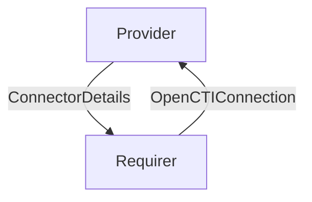

# `opencti-connector`

## Usage

This relation interface describes the expected behavior of any charm claiming to be able to provide or consume opencti-connector data.

In most cases, this will be accomplished using the [opencti-connector library](https://github.com/canonical/opencti-operator/blob/main/lib/charms/opencti/v0/opencti_connector.py), although charm developers are free to provide alternative libraries as long as they fulfill the behavioral and schematic requirements described in this document.

## Direction
The `opencti-connector` interface does not implement a typical provider/requirer pattern. The interface is designed specifically for OpenCTI connectors, with the assumption that there will always be a single OpenCTI provider. To streamline the development of 20+ nearly identical connectors, a shared `OpenctiConnectorCharm` base class was created to encapsulate common relation logic, reducing boilerplate and simplifying charm creation. The `OpenctiConnectorCharm` class is inherited by connector charms that want to consume this library, such as the [crowdstrike connector charm](https://github.com/canonical/opencti-operator/tree/main/connectors/crowdstrike).



## Behavior

The requirer and the provider need to adhere to a certain set of criteria to be considered compatible with the interface.

### Provider

- It is expected to inherit the `OpenctiConnectorCharm` class.
- Is it expected to provide the `connector_type`. More information on the different connector types can be found in the [OpenCTI documentation](https://docs.opencti.io/latest/deployment/connectors/#connector-configuration).
- It is expected to provide the path to the charm root directory containing `charmcraft.yaml` by overriding the `charm_dir` property.

### Requirer

- Is expected to provide an OpenCTI URL and token that the provider side can connect to. 

## Relation Data

Pydantic schemas for provider and requirer can be found [\[here\]](./schema.py)

### Provider

Exposes the `connector_name` and `connector_type` that OpenCTI requires to create a user with 
the appropriate privileges. `connector_name` and `connector_type` should be placed in 
the **application** databag. 

#### Example
```yaml
application-data: {
    "connector_charm_name": "connector-charm-name",
    "connector_type": "connector-type",
}
```

### Requirer

Exposes a `opencti_url` field containing the url at which OpenCTI is reachable. It also provides an `opencti_token` for authentication while reaching OpenCTI. Should be placed in the **application** databag.

#### Example

```yaml
application_data: {
   "opencti_url": "http://opencti-endpoints.stg-opencti.svc:8080",
    "opencti_token": "secret:secret-id",
}
```

