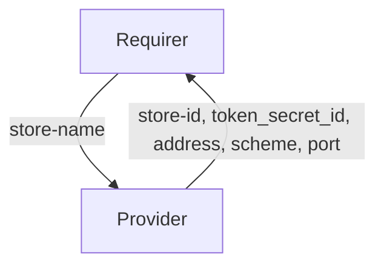

# `openfga`

## Usage

This relation interface describes the expected behaviour of any charm claiming to be able to interact with a OpenFGA.

In most cases, this will be accomplished using the [openfga library](https://github.com/canonical/cs-openfga/blob/main/charms/openfga-k8s/lib/charms/openfga_k8s/v0/openfga.py), although charm developers are free to provide alternative libraries as long as they fulfil the behavioural and schematic requirements described in this document.

## Direction



As with all Juju relations, the `openfga` interface consists of two parties: a Provider (openfga charm), and a Requirer (application charm). The Requirer will be expected to expose an authentication store name, and the Provider will create and forward new unique credentials (along with other optional fields), which can be used to access the OpenFGA store.

## Behavior

Both the Requirer and the Provider need to adhere to the following criteria to be considered compatible with the interface.

### Provider
- Is expected to create an authentication store in OpenFGA when the requirer provides the `store_name` field.
- Is expected to expose to the Requirer `token_secret_id`, `store_id`, `address`, `scheme` and `port` fields in the *application* databag.

### Requirer
- Is expected to provide the `store_name` it requires in its application databag
- Is expected to use the `token_secret_id`, `store_id`, `address`, `scheme` and `port` fields, when exposed by the `Provider`, to set up an OpenFGA connection.

## Relation Data

### Provider

[\[JSON Schema\]](./schemas/provider.json)

Provider exposes `token_secret_id`, `store_id`, `address`, `scheme` and `port` fields in the **application** databag.


#### Example
```yaml
  relation-info:
  - endpoint: openfga
    related-endpoint: openfga
    application-data:
      token_secret_id: "10559c09-6416-40b0-9402-54b6e28edd3a"
      store_id: "01GK13VYZK62Q1T0X55Q2BHYD6"
      address: "10.10.0.17"
      scheme: "http"
      port: 8080
```

### Requirer

[\[JSON Schema\]](./schemas/requirer.json)

The Requirer exposes the store name for which authorization is requested in the **application** databag.

#### Example

```yaml
  relation-info:
  - endpoint: openfga
    related-endpoint: openfga
    application-data:
      store_name: "test-store"
```
