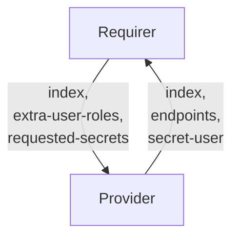

# `opensearch_client`

## Usage

This relation interface describes the expected behaviour of any charm interfacing with OpenSearch or ElasticSearch charms, such as the [Charmed OpenSearch Operator](https://github.com/canonical/opensearch-operator) using the `opensearch-client` relation.  This interface is likely to satisfy the requirements of any ElasticSearch API-compatible application, but feel free to [open a PR](https://github.com/canonical/charm-relation-interfaces/pulls) to modify this document if it doesn't meet your requirements.

In most cases, this will be accomplished using the [data_interfaces library](https://github.com/canonical/data-platform-libs/blob/main/lib/charms/data_platform_libs/v0/data_interfaces.py), although charm developers are free to provide alternative libraries as long as they fulfil the behavioural and schematic requirements described in this document.

## Direction



As with all Juju relations, the `opensearch-client` interface consists of two parties: a Provider (opensearch charm), and a Requirer (application charm). The Requirer will be expected to provide an index name, and the Provider will provide new unique credentials (along with other optional fields), which can be used to access the index itself.

## Behavior

Both the Requirer and the Provider need to adhere to criteria to be considered compatible with the interface.

If both sides support Juju Secrets, sensitive information is transmitted through Juju Secrets rather than directly through the relation data bag(s). Corresponding pieces of information are grouped together in a single secret.
If any side, Provider or Requirer doesn't support Juju Secrets, sensitive information is transmitted through the relational data bag in the same fields as in Juju Secret.

### Provider

- Is expected to create an application user inside the opensearch cluster when the requirer provides the `index` field.
  - This user is removed when the relation is removed.
  - Is expected to apply the permissions in the `extra-user-roles` provided by the Requirer to this user (e.g. `extra-user-roles=admin`).
  - If multiple relations require the same index name, they should all be able to access it.
- Is not expected to create an index on relation creation.
  - Responsibility for managing an index rests with the requirer application, including creating and removing indices.
- Is expected to provide the `index` field with the index that has been made available to the Requirer.
- Is expected to provide relation user credentials (`username` and `password`) in a Juju Secret whenever the Requirer supplies the `index` field, but not the `entity-type` one.
- Is expected to provide custom entity credentials (`entity-name` and `entity-password`) in a Juju Secret whenever the Requirer supplies both the `index` and `entity-type` fields.
- Is expected to expose the Juju Secrets URI to the credentials through the `secret-user` field of the data bag.
- Is expected to provide the `endpoints` field containing all cluster endpoint addresses in a comma-separated list.
- Is expected to provide the `version` field describing the installed version number of opensearch.
- Is expected to provide the CA chain in the `tls-ca` field of a Juju Secret, whenever the provider has TLS enabled (such as using the [TLS Certificates Operator](https://github.com/canonical/tls-certificates-operator)).
- Is expected to share the TLS Juju Secret URI through the `secret-tls` field of the databag.
- If the Requirer asks for additional secrets (via `requested-secrets`, see below) other than those stored in the `user` and `tls` secrets, Provider is expected to define a `secret-extra` field holding the URI of the Juju Secret containing all additional secret fields.

### Requirer

- Is expected to provide `requested-secrets`, which is a list of field names that are not to be exposed on the relation databag, but handled within Juju Secrets. It should be JSON parsable array of strings, and correspond to valid Juju Secret keys (i.e. alphanumerical characters with a potential '-' (dash) character). Secret fields must contain `username` and `password` (and `tls-ca` in case TLS is enabled).
- Is expected to provide an index name in the `index` field.
- Is expected to manage its own index.
  - Indices are not created on the provider application when the relation is created. The `index` field exists to grant the correct permissions for the relation user, which the requirer charm uses to control its index.
  - This index is NOT removed from the provider charm when the relation is removed.
- Is expected to have different relations with the same interface name if Requirer needs access to multiple opensearch indices.
- Can optionally provide user roles in the `extra-user-roles` field. These roles will be applied to the requested user or relation user.
  - This value can be empty, in which case a default will be applied, or it can be set to `admin`:
    - default: this has read-write permissions over the index that has been generated for this relation.
    - admin: this has control over the cluster, including creating new indices and setting cluster node roles.
  - Specifics of how these roles are implemented have been left to the provider charm developers, since they vary slightly between opensearch API-compliant applications.
- Can optionally provide group roles in the `extra-group-roles` field. These roles will be applied to the requested group.
- Can optionally provide the `entity-type` field specifying the type of entity to request, instead of an index.
- Can optionally provide the `entity-permissions` field specifying the permissions for the requested entity.
- Is expected to tolerate that the Provider may ignore the `index` field in some cases and instead use the index name received.

## Relation Data

### Provider

[\[JSON Schema\]](./schemas/provider.json)

Provider provides credentials, endpoint addresses, TLS info and index-specific fields in the **application** databag.


#### Example
```yaml
  relation-info:
  - endpoint: opensearch-client
    related-endpoint: opensearch-app-consumer
    application-data:
      endpoints: 10.180.162.200:9200,10.180.162.75:9200
      secret-user: secret://59060ecc-0495-4a80-8006-5f1fc13fd783/cjqub6vubg2s77p3nio0
      secret-tls: secret://59060ecc-0495-4a80-8006-5f1fc13fd783/cjqub7fubg2s77p3niog
```

### Requirer

[\[JSON Schema\]](./schemas/requirer.json)

Requirer provides the index name in the **application** databag.

#### Example

```yaml
  relation-info:
  - endpoint: opensearch-app-consumer
    related-endpoint: opensearch-client
    application-data:
      index: myindex
      requested-secrets: ["username", "password", "tls-ca", "uris"]
```
