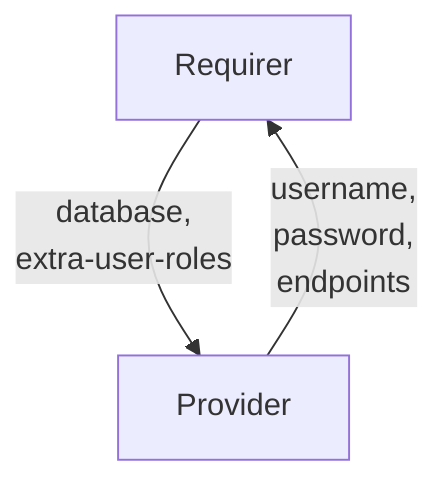

# `opensearch_client`

## Usage

This relation interface describes the expected behaviour of any charm claiming to be able to interact with an opensearch index.

In most cases, this will be accomplished using the [data_interfaces library](https://github.com/canonical/data-platform-libs/blob/main/lib/charms/data_platform_libs/v0/data_interfaces.py), although charm developers are free to provide alternative libraries as long as they fulfil the behavioural and schematic requirements described in this document.

## Direction



As with all Juju relations, the `database` interface consists of two parties: a Provider (database charm), and a Requirer (application charm). The Requirer will be expected to provide an index name, and the Provider will provide new unique credentials (along with other optional fields), which can be used to access the index itself.

## Behavior

Both the Requirer and the Provider need to adhere to criteria to be considered compatible with the interface.

### Provider
- Is expected to create an application user inside the opensearch cluster when the requirer provides the `database` field.
- Is expected to provide `username` and `password` fields when Requirer provides the `database` field.
- Is expected to provide the `endpoints` field containing all cluster host addresses in a comma-separated list.
- Is expected to provide the `version` field whenever database charm wants to communicate its database version.

### Requirer

- Is expected to provide an index name in the `database` field.
- Is expected to provide indentical values in the `database` field if several requirer units provide it in the relation.
- Is expected to have unique credentials for each relation. Therefore, different instances of the same Charm (juju applications) will have different relations with different credentials.
- Is expected to have different relations names on Requirer with the same interface name if Requirer needs access to multiple database charms.
- Is expected to allow multiple different Juju applications to access the same database name.
- Is expected to add any `extra-user-roles` provided by the Requirer to the created user (e.g. `extra-user-roles=admin`).
  - If this is not set to a default

## Relation Data

### Provider

[\[JSON Schema\]](./schemas/provider.json)

Provider provides credentials, endpoints, TLS info and database-specific fields. It should be placed in the **application** databag.


#### Example
```yaml
  relation-info:
  - endpoint: database
    related-endpoint: database
    application-data:
      database: myindex
      endpoints: 10.180.162.200:9200,10.180.162.75:9200
      password: Dy0k2UTfyNt2B13cfe412K7YGs07S4U7
      username: opensearch-client_4_user
```

### Requirer

[\[JSON Schema\]](./schemas/requirer.json)

Requirer provides index name in `database` unit. Should be placed in the **unit** databag
in at least one unit of the Requirer.

#### Example

```yaml
  relation-info:
  - endpoint: database
    related-endpoint: database
    application-data: {}
    related-units:
      worker-a/0:
        in-scope: true
        data:
          database: myindex
```
