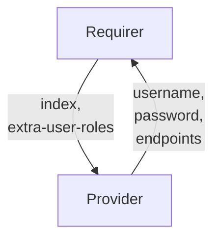

# `opensearch_client`

## Usage

This relation interface describes the expected behaviour of any charm interfacing with OpenSearch or ElasticSearch charms, such as the [Charmed OpenSearch Operator](https://github.com/canonical/opensearch-operator) using the `opensearch-client` relation.

In most cases, this will be accomplished using the [data_interfaces library](https://github.com/canonical/data-platform-libs/blob/main/lib/charms/data_platform_libs/v0/data_interfaces.py), although charm developers are free to provide alternative libraries as long as they fulfil the behavioural and schematic requirements described in this document.

## Direction



As with all Juju relations, the `opensearch-client` interface consists of two parties: a Provider (opensearch charm), and a Requirer (application charm). The Requirer will be expected to provide an index name, and the Provider will provide new unique credentials (along with other optional fields), which can be used to access the index itself.

## Behavior

Both the Requirer and the Provider need to adhere to criteria to be considered compatible with the interface.

### Provider

- Is expected to create an application user inside the opensearch cluster when the requirer provides the `index` field.
  - This user is removed when the relation is removed.
  - Is expected to apply the permissions in the `extra-user-roles` provided by the Requirer to this user (e.g. `extra-user-roles=admin`).
  - If multiple relations require the same index name, they should all be able to access it.
- Is not expected to create an index on relation creation.
  - Responsibility for managing an index rests with the requirer application, including creating and removing indices.
- Is expected to provide unique `username` and `password` fields as Juju Secrets when Requirer provides the `index` field.
- Is expected to provide the `endpoints` field containing all cluster endpoint addresses in a comma-separated list.
- Is expected to provide the `version` field describing the installed version number of opensearch.
- If the charm has TLS enabled (such as using the [TLS Certificates Operator](https://github.com/canonical/tls-certificates-operator)), it is expected to provide the CA chain in the `tls-ca` field as a Juju Secret.

### Requirer

- Is expected to provide an index name in the `index` field.
- Is expected to manage its own index.
  - Indices are not created on the provider application when the relation is created. The `index` field exists to grant the correct permissions for the relation user, which the requirer charm uses to control its index.
  - This index is NOT removed from the provider charm when the relation is removed.
- Is expected to have different relations with the same interface name if Requirer needs access to multiple opensearch indices.
- Is expected to provide user permissions in the `extra-user-roles` field. These permissions will be applied to the user created for the relation.
  - These permissions can be set to two values:
    - default: this has read-write permissions over the index that has been generated for this relation. This permission level will be applied if no value is provided.
    - admin: this has control over the index, including how cluster roles are assigned to nodes in the cluster.
  - Specifics of how these permissions are implemented have been left to the provider charm developers, since they vary slightly between opensearch API-compliant applications.

## Relation Data

### Provider

[\[JSON Schema\]](./schemas/provider.json)

Provider provides credentials, endpoint addresses, TLS info and index-specific fields. It should be placed in the **application** databag.


#### Example
```yaml
  relation-info:
  - endpoint: opensearch-client
    related-endpoint: opensearch-app-consumer
    application-data:
      index: myindex
      endpoints: 10.180.162.200:9200,10.180.162.75:9200
      password: Dy0k2UTfyNt2B13cfe412K7YGs07S4U7
      username: opensearch-client_4_user
```

### Requirer

[\[JSON Schema\]](./schemas/requirer.json)

Requirer provides index name. This should be placed in the **unit** databag in at least one unit of the Requirer.

#### Example

```yaml
  relation-info:
  - endpoint: opensearch-app-consumer
    related-endpoint: opensearch-client
    application-data: {}
    related-units:
      worker-a/0:
        in-scope: true
        data:
          index: myindex
```
