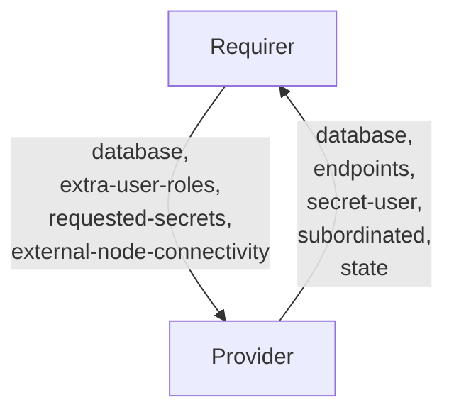

# `postgresql_client`

## Usage

This relation interface describes the expected behaviour of any charm claiming to be able to interact with a PostgreSQL database.
Our intent to have different interface names with `<database>_client` pattern (like `mongodb_client`) and the same validation rules for multiple databases (e.g. MySQL, PostgreSQL, MongoDB, etc).

In most cases, this will be accomplished using the [data_interfaces library](https://github.com/canonical/data-platform-libs/blob/main/lib/charms/data_platform_libs/v0/data_interfaces.py), although charm developers are free to provide alternative libraries as long as they fulfil the behavioural and schematic requirements described in this document.

Some Providers may be subordinate charms aimed at providing mainly a local service within a principal. In cases where the Requirer needs to expose the service beyond its host, it should request for external connectivity by the Provider. An example use case would be the data-integrator charm integrating with a subordinate router.

## Direction



As with all Juju relations, the `database` interface consists of two parties: a Provider (database charm), and a Requirer (application charm). The Requirer will be expected to provide a database name, and the Provider will provide new unique credentials (along with other optional fields), which can be used to access the actual database cluster.

## Behavior

Both the Requirer and the Provider need to adhere to criteria to be considered compatible with the interface.

If both sides support Juju Secrets, sensitive information is transmitted through Juju Secrets rather than directly through the relation data bag(s). Corresponding pieces of information are grouped together in a single secret.
If any side, Provider or Requirer doesn't support Juju Secrets, sensitive information is transmitted through the relational data bag in the same fields as in Juju Secret.

### Provider
- Is expected to create an application user inside the database cluster when the requirer provides the `database` field.
- Is expected to provide relation user credentials (`username` and `password`) in a Juju Secret whenever the Requirer supplies the `database` field, but not the `entity-type` one.
- Is expected to provide custom entity credentials (`entity-name` and `entity-password`) in a Juju Secret whenever the Requirer supplies both the `database` and `entity-type` fields.
- Is expected to expose the Juju Secrets URI to the credentials through the `secret-user` field of the data bag.
- Is expected to provide the `endpoints` field with the address of Primary, which can be used for Read/Write queries.
- Is expected to provide the `database` field with the database that was actually created or the prefix requested by the requirer.
- Is expected to provide the `uris` field with the connection string, in libpq's URI format, which can be used for direct connection to the db.
- Is expected to provide the `read-only-uris` field with the connection string when requested as a secret field, in libpq's URI format, which can be used for direct connection to a read only edpoint of a cluster.
- Is expected to provide optional `read-only-endpoints` field with a comma-separated list of hosts or one Kubernetes Service, which can be used for Read-only queries.
- Is expected to provide the `version` field whenever database charm wants to communicate its database version.
- Is expected to provide the `tls` field flag, indicating whether the provider has TLS enabled or not.
- Is expected to provide the CA chain in the `tls-ca` field of a Juju Secret, whenever the provider has TLS enabled (such as using the [TLS Certificates Operator](https://github.com/canonical/tls-certificates-operator)).
- Is expected to share the TLS Juju Secret URI through the `secret-tls` field of the databag.
- If the Requirer asks for additional secrets (via `requested-secrets`, see below) other than those stored in the `user` and `tls` secrets, Provider is expected to define a `secret-extra` field holding the URI of the Juju Secret containing all additional secret fields.
- Is expected to express (via `external-node-connectivity`) whether external connectivity requests are to be respected or not, in case the charm is capable of such.
- May require delays (via `subordinated`) to provide service on Requirer scale up. If so, it is expected to set unit level `state` data when it is `ready` to serve.
- May respect the `entity-name` and `password` set in `requested-entity-secret`.
- Is expected to populate `prefix-databases`, if a prefix was requested and any databases match the prefix.

### Requirer

- Is expected to provide `requested-secrets`, which is a list of field names that are not to be exposed on the relation databag, but handled within Juju Secrets. It should be JSON parsable array of strings, and correspond to valid Juju Secret keys (i.e. alphanumerical characters with a potential '-' (dash) character). Secret fields must contain `username` and `password` (and `tls-ca` in case TLS is enabled).
- Is expected to provide either a database name field or a prefix (ending in `*` and containing at least three additional characters) in the `database` field.
- Is expected to have unique credentials for each relation. Therefore, different instances of the same Charm (juju applications) will have different relations with different credentials.
- Is expected to have different relations names on Requirer with the same interface name if Requirer needs access to multiple database charms.
- Is expected to allow multiple different Juju applications to access the same database name.
- Can optionally add any `extra-user-roles` provided by the Requirer to the requested user or relation user (e.g. `extra-user-roles=admin`).
- Can optionally add any `extra-group-roles` provided by the Requirer to the requested group (e.g. `extra-group-roles=admin`).
- Can optionally add field `entity-type` provided by the Requirer to the created a custom entity, instead of a database.
- Can optionally add field `entity-permissions` provided by the Requirer to tweak custom entity permissions.
- Is expected to tolerate that the Provider may ignore the `database` field in some cases and instead use the database name received.
- Is expected to respect the `subordinated` flag when scaling up and start emitting events only once unit level `state` is `ready`.
- May require external connectivity (via `external-node-connectivity`).
- May request specific entity credentials inside a secret set as `requested-entity-secret` field. Expected values in the secret are `entity-name` and an optional `password`. The requirer must be able to handle the requested values for `entity-name` and `password` not being respected.

## Relation Data

### Provider

[\[JSON Schema\]](./schemas/provider.json)

Provider provides credentials, endpoints, TLS info and database-specific fields. It should be placed in the **application** databag.


#### Example
```yaml
  relation-info:
  - endpoint: database
    related-endpoint: database
    application-data:
      database: myappB
      endpoints: postgresql-k8s-primary:5432
      read-only-endpoints: postgresql-k8s-replicas:5432
      secret-user: secret://59060ecc-0495-4a80-8006-5f1fc13fd783/cjqub6vubg2s77p3nio0
      secret-tls: secret://59060ecc-0495-4a80-8006-5f1fc13fd783/cjqub7fubg2s77p3niog
```

### Requirer

[\[JSON Schema\]](./schemas/requirer.json)

Requirer provides database name. It should be placed in the **application** databag.

#### Example

```yaml
  relation-info:
  - endpoint: database
    related-endpoint: database
    application-data:
      database: myappA
    requested-secrets: ["username", "password", "tls-ca", "uris"]
```
