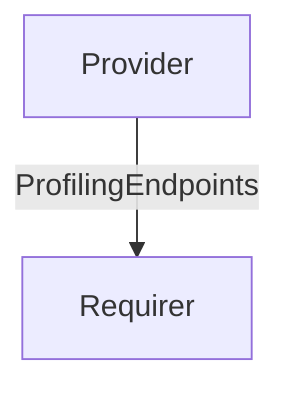

# `profiling`

## Usage

This interface can be used by an application able to ingest profiling data to expose the ingestion 
endpoint(s) to any application able to push into them.

The reference implementation of this interface (v0) can be found at [this address](https://github.com/canonical/pyroscope-k8s-operator/blob/main/coordinator/lib/charms/pyroscope_coordinator_k8s/v0/profiling.py).

## Direction

This interface implements a provider/requirer pattern. As is customary, the provider is the server 
(the profiling data ingester) and the requirer is the profiling data source.

The interface is unidirectional: the provider doesn't need any information from the requirer.
The provider shares any and all supported ingestion endpoints.



## Behavior
### Provider

- Must publish all active ingestion endpoints.
- Must accept data on those endpoints
- If ingress is available, the provider must advertise its ingressed hostname, 
  otherwise fall back to using its own cluster-internal fqdn.
- Must pass `insecure=True` if the ingestion endpoints are running with insecure connection.

## Relation Data

[\[Pydantic Schema\]](./schema.py)

#### Example
A yaml/json example of a valid databag state (for the whole relation), in absence of an ingress 
integration for the provider:
```yaml
provider:
  app: {
         otlp_grpc_endpoint_url: "my.fqdn.cluster.local:1234",
         insecure: False,
  }
  unit: {}
requirer:
  app: {}
  unit: {}
```

If the provider is ingressed:
```yaml
provider:
  app: {
         # `10.0.0.1` is the ingress hostname of the provider charm
         otlp_grpc_endpoint_url: "10.0.0.1:1234",
         insecure: False,
  }
  unit: {}
requirer:
  app: {}
  unit: {}
```
