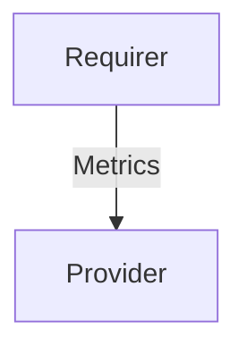

# `prometheus_remote_write`

## Usage

This relation interface describes the expected behavior of any charm claiming to be able to provide or require Prometheus Remote Write data.

In most cases, this will be accomplished using the [prometheus_remote_write library](https://charmhub.io/prometheus-k8s/libraries/prometheus_remote_write), although charm developers are free to provide alternative libraries as long as they fulfill the behavioral and schematic requirements described in this document.

## Direction



As all Juju relations, the `prometheus_remote_write` interface consists of a provider and a requirer. One of these, in this case the `provider`, will be expected to stand up a remote write-compatible webserver where the `Requirer` will be able to send it's metrics.

## Behavior

Both the Requirer and the provider need to adhere to a certain set of criterias to be considered compatible with the interface.

### Provider

- Is expected to provide one or more endpoints for Prometheus remote write in the relation data bag.
- Is expected to be able to ingest alert rules exposed over the relation data bag.
- Is expected to respect the metrics topology set by the requirer.
- Is expected to inject alert rule topology labels as label matchers in alert rule expressions.
- Is expected not to inject juju_unit as a label matcher by default, but to honor it if hard-coded by the user.
- Is expected to be able to ingest both single alert rules and alert rule groups provided over the relation data bag.


### Requirer
- Is expected to be able to push Prometheus metrics to a remote write endpoint
- Is expected to fetch the target configuration from the relation data bag 
- Is expected to push all metrics to every remote write target available in the data bag.
- Is expected to provide alert rules over the relation data bag.
- Is expected to provide any wanted label matchers as labels on every alert rule in the relation data bag.
- Is expected to add any wanted topology labels to all metrics sent to the provider.
- Is expected to be able to expose both single alert rules and alert rule groups over the relation data bag

## Relation Data

### Provider

[\[JSON Schema\]](./schemas/provider.json)

Exposes all endpoints the requirer should write metrics to. Should be placed in the **unit** databag for each 
unit of the provider capable of receiving metrics over remote write.

#### Example

```yaml
related-units:
  some-Requirer/0:
    # ...
    data:
      # ...
      remote_write: {
        "url": "http://192.168.1.2:9090/api/v1/write"
      }
```

### Requirer

[\[JSON Schema\]](./schemas/requirer.json)

Exposes all alert rules relevant to the metrics being sent over. Expected to contain expressions without Juju topology injected, but with the topology available as labels. Should be placed in the **application** databag.

#### Example
```yaml
application-data:
  alert_rules: {
    "groups": [
      {
        "name": "some-model_00000000-0000-0000-0000-000000000000_requirer-charm_alerts",
        "rules": [
          {
            "alert": "RequirerCharmUnavailable",
            "expr": "up{juju_model=\"some-model\",juju_model_uuid=\"00000000-0000-0000-0000-000000000000\", juju_application=\"requirer-charm\"} < 1",
            "for": "0m",
            "labels": {
              "severity": "critical",
              "juju_model": "some-model",
              "juju_model_uuid": "00000000-0000-0000-0000-000000000000",
              "juju_application": "requirer-charm"
            },
            "annotations": {
              "summary": "Requirer Charm {{ $labels.juju_model}}/{{ $labels.juju_unit }} unavailable",
              "description": "The Requirer Charm {{ $labels.juju_model }} {{ $labels.juju_unit }} is unavailable LABELS = {{ $labels }}\n"
            }
          }
        ]
      }
    ]
  }
```


