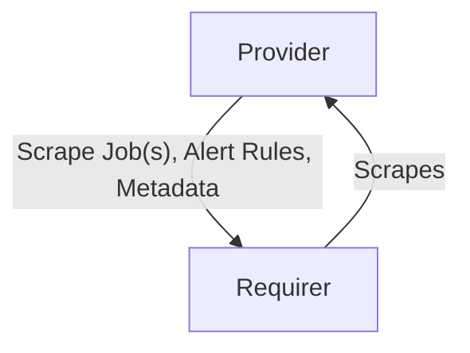

# `prometheus_scrape`

## Usage

This relation interface describes the expected behavior of any charm claiming to be able to provide or require Prometheus Scrape Endpoints.

In most cases, this will be accomplished using the [prometheus_scrape library](https://charmhub.io/prometheus-k8s/libraries/prometheus_scrape), although charm developers are free to provide alternative libraries as long as they fulfill the behavioral and schematic requirements described in this document.

## Direction



As all Juju relations, the `prometheus_scrape` interface consists of a provider and a requirer. One of these, in this case the `Provider`, will be expected to stand up one or more scrape compatible metrics endpoint where the `Requirer` will be able to scrape the `Provider`s metrics.

## Behavior

Both the Requirer and the provider need to adhere to a certain set of criterias to be considered compatible with the interface.

### Provider

- Is expected to provide one or more Prometheus scrape jobs in the relation data bag.
- Is expected to respect the metrics topology set by the requirer.
- Is expected to provide alert rules over the relation data bag.
- Is expected to add any wanted topology labels to all metrics sent to the provider.
- Is expected to provide any wanted topology label matchers as labels on every alert rule in the relation data bag.
- Is expected to be able to expose both single alert rules and alert rule groups over the relation data bag.
- Is expected to send alert rules where the contain expressions lacks Juju topology label selectors.

### Requirer
- Is expected to be able to scrape Prometheus metrics from a metrics endpoint
- Is expected to be able to ingest alert rules exposed over the relation data bag.
- Is expected to fetch the target configuration from the relation data bag.
- Is expected to inject alert rule topology labels as label matchers in alert rule expressions.
- Is expected not to inject juju_unit as a label matcher by default, but to honor it if hard-coded by the user.
- Is expected to be able to ingest both single alert rules and alert rule groups provided over the relation data bag.

## Relation Data

### Provider

[\[JSON Schema\]](./schemas/provider.json)

- Exposes all scrape jobs the requirer should scrape metrics through. Should be placed in the **application** databag.
- Exposes the unit address of each unit to be scraped, along with the unit name. Additionally, it includes an optional path provided by the unit for Prometheus scraping. This path is present when the provider charm is backed by an Ingress or a Proxy. Should be placed in the **unit** databag of each scrapable unit.

#### Example


```yaml
application-data:
  alert_rules: '{
    "groups": [
      {
        "name": "an_alert_rule_group",
        "rules": [
          {
            "alert": "SomethingIsUp",
            "expr": "something_bad == 1",
            "for": "0m",
            "labels": {
              "some-label": "some-value"
            },
            "annotations": {
              "some-annotation": "some-other-value"
            }
          }
        ]
      }
    ]
  }'
  scrape_jobs: '[
    {
      "metrics_path": "/metrics", 
      "static_configs": [
        { "targets": ["*:4080"] }
      ]
    }
  ]'
  scrape_metadata: '{
    "model": "cos",
    "model_uuid": "c2e9f4d5-dcb3-4870-8509-330eb9745ee8",
    "application": "zinc-k8s",
    "unit": "zinc-k8s/0",
    "charm_name": "zinc-k8s"
  }'
related-units:
  zinc-k8s/0:
    data:
      prometheus_scrape_unit_address: zinc-k8s-0.zinc-k8s-endpoints.cos.svc.cluster.local
      prometheus_scrape_unit_name: zinc-k8s/0
      prometheus_scrape_unit_path: ""
      # ...
    # ...
  zinc-k8s/1:
    data:
      prometheus_scrape_unit_address: zinc-k8s-1.zinc-k8s-endpoints.cos.svc.cluster.local
      prometheus_scrape_unit_name: zinc-k8s/1
      prometheus_scrape_unit_path: ""
      # ...
    # ...
```

### Requirer

No relation data should be exposed by the requirer of this relation.
