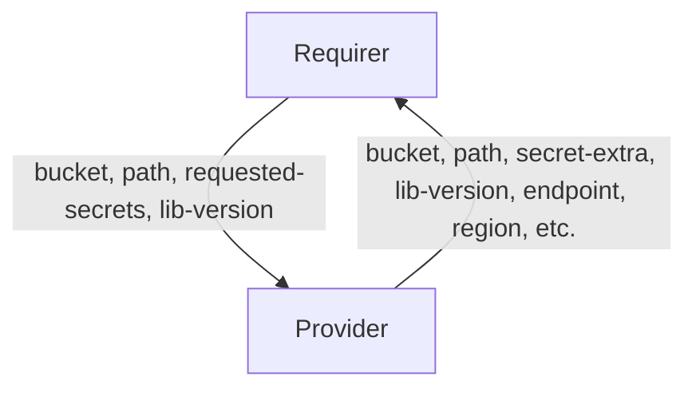

# `s3` (v1)

## Usage

This relation interface describes the expected behaviour of any charm claiming to be able to interact with AWS S3 object storage protocol.
This relation interface should be used for all S3 protocol compatible providers, including AWS S3, MinIO, Ceph or Rook.
This interface will be accomplished using the provider library `s3`, although charm developers are free to provide alternative libraries as long as they fulfil the behavioural and schematic requirements described in this document.


## What's different from `v0`?
The `v1` of the `s3` interface is different from `v0` of the same interface in the following aspects:
1) The `v1` shares the `secret-key` and `access-key` by encapsulating it into a Juju secret and sharing the secret URI in a field named `secret-extra` over the relation databag , as compared to `v0` sharing the `secret-key` and `access-key` as plaintext over the relation databag.
2) Both provider and requirer sides of the `v1` interface also share an extra field `lib-version`, which is of format `{LIBAPI}.{LIBPATCH}`. This is supposed to notify the other side of the interface what version of the lib this side is currently on -- which could help the other side implement different behavior based on the version of lib in this side, if necessary.


## Direction



As with all Juju relations, the `s3` interface consists of two parties: a Provider (object storage charm) and a Requirer (application charm). The Provider will be expected to provide S3 credentials (along with `endpoint`, `container`, `prefix` and other fields), which can be used to access the actual object storage.


## Migration Strategy
To upgrade a charm that uses `v0` of this interface to `v1` interface is as simple as upgrading the interface charm-lib from `0.x` to `1.x`. The newer version of the lib still supports the charms using the `v0` interface; however the relation needs to be broken and created again to realize the changes in the interface in `v1`.

As for the `s3-integrator` charm from `1/stable`, in-place charm refresh is not supported since the charm in `1/stable` is built on `22.04` base and the newer charm in `2/edge` is built on `24.04` base.


## Behaviour

Both the Requirer and the Provider must adhere to criteria to be compatible with this interface.

### Provider
- It is expected to create a bucket with application "credentials pair" inside the object storage when a relation joins, if a bucket is requested to be created by either provider or the requirer and share `bucket` field if it is available.
- It is expected to share `secret-extra` field that contains `access-key` and `secret-key` values encapsulated into a Juju secret.
- It is expected to share an optional `path` field containing the path in the bucket that is to be used.
- It is expected to share an optional `endpoint` field containing a URL.
- It is expected to share an optional `region` field for Region.
- It is expected to share an optional `s3-uri-style` field for (S3 protocol specific) bucket path lookup. The field can take only `host` and `path` values.
- It is expected to share an optional `storage-class` field for the S3 storage class.
- It is expected to share an optional `tls-ca-chain` field for TLS verification. This field is shared by the provider if the S3 cloud has enforced TLS with custom CA certificate and can take a list of strings. Each string should be in base64 form and represent one certificate. All certificates together should represent a complete CA chain which can be used for HTTPS validation.
- It is expected to share an optional `s3-api-version` field for the (S3 protocol specific) API signature. The field can take only `2` and `4` values.
- It is expected to share an optional `attributes` field for the custom metadata. The field can take a list of strings. Server-Side-Encryption headers should be passed into this field, if any.
- It is expected to share the `lib-version` field containing the version of `s3` charm lib it is currently using.

### Requirer
- Is expected to optionally share a bucket name in the `bucket` field and / or a path in the `path` field -- which is equivalent to the requirer requesting a particular bucket / path to the provider.
- Is expected to tolerate that the Provider may ignore the `bucket` and `path` field in some cases (e.g. S3Proxy or S3 Integrator) and instead use the bucket name and path received. The provider may ignore the request from the requirer and share a different bucket and/or path instead.
- Is expected to allow multiple different Juju applications to access the same bucket name.
- Is expected to have different relations endpoints on Requirer with the same interface name if Requirer needs access to multiple buckets, if the provider is configured in a way that it heeds the request from the requirer. However, if the Provider choses to ignore the request for a bucket from requirer, the requirer is expected to have relation with different Provider instance per bucket to have access to multiple buckets, such that each of those buckets are configured and provided by each instance of the Provider instead.
- It is expected to share the `lib-version` field containing the version of `s3` charm lib it is currently using.


## Relation Data

### Provider

[\[JSON Schema\]](./schemas/provider.json)

The Provider provides credentials, endpoints, TLS info and database-specific fields. It should be placed in the **application** databag.


#### Example
```yaml
  relation-info:
  - endpoint: object
    related-endpoint: object
    application-data:
      bucket: mybucket
      secret-extra: secret://91f805c5-5b49-47a3-8e7b-70befa766caf/d40rbhnmp25c76d6bdn0
      path: my/path
      endpoint: https://my-s3-endpoint/
      region: us-east-1
      s3-uri-style: path
      storage-class: glacier
      tls-ca-chain: base64-encoded-ca-chain==
      s3-api-version: 4
      attributes: Cache-Control=max-age=90000,min-fresh=9000;X-Amz-Server-Side-Encryption-Customer-Key=CuStoMerKey=
      lib-version: 1.10
```

The field `secret-extra` contains a Juju secret URI, whose content looks like:
```yaml
access-key: my-s3-access-key
secret-key: my-s3-secret-key
```

### Requirer

[\[JSON Schema\]](./schemas/requirer.json)

Requirer shares bucket name and / or a path in the **application** databag. The requirer also shares the version of S3 lib it uses, and a field named `requested-secrets` informing the provider of which fields it wants as encoded inside a secret, containing the value `["access-key", "secret-key"]`.

#### Example

```yaml
  relation-info:
  - endpoint: object
    related-endpoint: object
    application-data:
      bucket: mybucket
      path: my/path
      requested-secrets: "[\"access-key\", \"secret-key\"]"
      lib-version: 1.10
```
