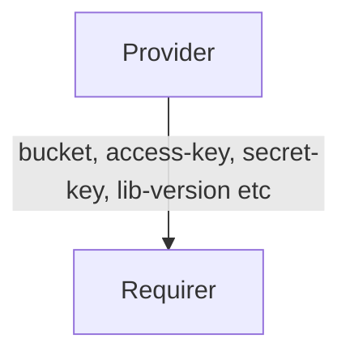

# `s3` (v1)

## Usage

This relation interface describes the expected behaviour of any charm claiming to be able to interact with AWS S3 object storage protocol.
This relation interface should be used for all S3 protocol compatible providers, including AWS S3, MinIO, Ceph or Rook.
This interface will be accomplished using the provider library, although charm developers are free to provide alternative libraries as long as they fulfil the behavioural and schematic requirements described in this document.


## Direction




## What's different from `v0`?
The `v1` of the `s3` interface, is different from `v0` of the same interface in the following aspects:
1) The `v1` shares the `secret-key` and `access-key` by encapsulating it into a Juju secret and sharing the secret URI over the relation databag, as compared to `v0` sharing the `secret-key` and `access-key` as plaintext over the relation databag.
2) Both provider and requirer side of the `v1` interface also share an extra field `lib-version`, which is of format `{LIBAPI}.{LIBPATCH}`. This is supposed to notify the other side of the interface what version of the lib this side is currently on -- which could help the other side implement different behavior based on the version of lib in this side, if necessary.


As with all Juju relations, the `s3` interface consists of two parties: a Provider (object storage charm) and a Requirer (application charm). The Provider will be expected to provide new unique credentials (along with `endpoint`, `container`, `prefix` and other fields), which can be used to access the actual object storage.

## Behaviour

Both the Requirer and the Provider must adhere to criteria to be compatible with this interface.

### Provider
- It is expected to create a bucket with application "credentials pair" inside the object storage when a relation joins. And provide `bucket`, `access-key` and `secret-key` fields accordingly.
- It is expected to provide the `endpoint` field containing a URL.
- It is expected to provide an optional `region` field for Region.
- It is expected to provide an optional `s3-uri-style` field for (S3 protocol specific) bucket path lookup. The field can take only `host` and `path` values.
- It is expected to provide an optional `storage-class` field for the S3 storage class.
- It is expected to provide an optional `tls-ca-chain` field for TLS verification. The field can take a list of strings. Each string should be in base64 form and represent one certificate. All certificates together should represent a complete CA chain which can be used for HTTPS validation.
- It is expected to provide an optional `s3-api-version` field for the (S3 protocol specific) API signature. The field can take only `2` and `4` values.
- It is expected to provide an optional `attributes` field for the custom metadata. The field can take a list of strings. Server-Side-Encryption headers should be passed into this field, if any.
- It is expected to provide the `lib-version` field containing the version of `s3` charm lib it is currently using.

### Requirer
- Is expected to optionally provide a bucket name in the `bucket` field and / or a path in the `path` field.
- Is expected to tolerate that the Provider may ignore the `bucket` field in some cases (e.g. S3Proxy or S3 Integrator) and instead use the bucket name received.
- Is expected to allow multiple different Juju applications to access the same bucket name.
- Is expected to have unique credentials for each relation. Therefore, different instances of the same Charm (juju applications) will have different relations with different credentials.
- Is expected to have different relations names on Requirer with the same interface name if Requirer needs access to multiple buckets.

## Relation Data

### Provider

[\[JSON Schema\]](./schemas/provider.json)

The Provider provides credentials, endpoints, TLS info and database-specific fields. It should be placed in the **application** databag.


#### Example
```yaml
  relation-info:
  - endpoint: object
    related-endpoint: object
    application-data:
      bucket: minio
      access-key: RANDOM
      secret-key: RANDOM
      path: relation-68
      endpoint: https://minio-endpoint/
      region: us-east-1
      s3-uri-style: path
      storage-class: glacier
      tls-ca-chain: base64-encoded-ca-chain==
      s3-api-version: 4
      attributes: Cache-Control=max-age=90000,min-fresh=9000;X-Amz-Server-Side-Encryption-Customer-Key=CuStoMerKey=
```

### Requirer

[\[JSON Schema\]](./schemas/requirer.json)

Requirer provides bucket name. Should be placed in the **unit** databag in at least one unit of the Requirer.

#### Example

```yaml
  relation-info:
  - endpoint: object
    related-endpoint: object
    application-data: {}
    related-units:
      worker-a/0:
        in-scope: true
        data:
          bucket: myappA
```
