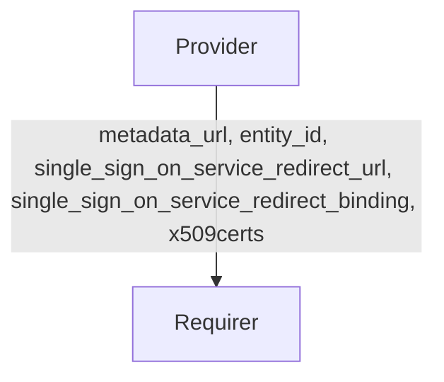

# `saml`

## Overview

This relation interface describes the expected behavior between of any charm claiming to be able to interface with a SAML Provider and the SAML Provider itself. This interface has been defined to support charms that require Launchpad group information. Other Identity Providers can be used interchangeably as long as custom attributes are not required.

## Usage

In most cases, this will be accomplished using the [saml library](https://github.com/canonical/saml-integrator-operator/blob/main/lib/charms/saml_integrator/v0/saml.py), although charm developers are free to provide alternative libraries as long as they fulfil the behavioural and schematic requirements described in this document.

## Direction

The `saml` interface implements a provider/requirer pattern.
The requirer is a charm that wishes to act as a SAML Service Provider, and the provider is a charm exposing a SAML Identity Provider.



## Behavior

The requirer and the provider must adhere to a certain set of criteria to be considered compatible with the interface.

### Provider

- Might provide the metadata_url in the relation databag.
- Is expected to provide the entity_id in the relation databag.
- Is expected to provide the single_sign_on_service_redirect_url in the relation databag.
- Is expected to provide the single_sign_on_service_redirect_binding in the relation databag.
- Is expected to provide the x509certs in the relation databag.

### Requirer

- Is not expected to provide anything

## Relation Data

### Provider

[\[JSON Schema\]](./schemas/provider.json)

Provider provides the SAML configuration. It should be placed in the **application** databag.

#### Example

```yaml
related-units: {}
application_data: {
  "metadata_url": "https://login.ubuntu.com/saml/metadata",
  "entity_id": "https://login.ubuntu.com",
  "single_sign_on_service_redirect_url": "https://login.ubuntu.com/saml/",
  "single_sign_on_service_redirect_binding": "urn:oasis:names:tc:SAML:2.0:bindings:HTTP-Redirect",
  "single_logout_service_redirect_url": "https://login.ubuntu.com/+logout",
  "single_logout_service_redirect_binding": "urn:oasis:names:tc:SAML:2.0:bindings:HTTP-Redirect",
  "x509certs": """-----BEGIN CERTIFICATE-----
      MIIC6DCCAdCgAwIBAgIUW42TU9LSjEZLMCclWrvSwAsgRtcwDQYJKoZIhvcNAQEL
      BQAwIDELMAkGA1UEBhMCVVMxETAPBgNVBAMMCHdoYXRldmVyMB4XDTIzMDMyNDE4
      NDMxOVoXDTI0MDMyMzE4NDMxOVowPDELMAkGA1UEAwwCb2sxLTArBgNVBC0MJGUw
      NjVmMWI3LTE2OWEtNDE5YS1iNmQyLTc3OWJkOGM4NzIwNjCCASIwDQYJKoZIhvcN
      AQEBBQADggEPADCCAQoCggEBAK42ixoklDH5K5i1NxXo/AFACDa956pE5RA57wlC
      BfgUYaIDRmv7TUVJh6zoMZSD6wjSZl3QgP7UTTZeHbvs3QE9HUwEkH1Lo3a8vD3z
      eqsE2vSnOkpWWnPbfxiQyrTm77/LAWBt7lRLRLdfL6WcucD3wsGqm58sWXM3HG0f
      SN7PHCZUFqU6MpkHw8DiKmht5hBgWG+Vq3Zw8MNaqpwb/NgST3yYdcZwb58G2FTS
      ZvDSdUfRmD/mY7TpciYV8EFylXNNFkth8oGNLunR9adgZ+9IunfRKj1a7S5GSwXU
      AZDaojw+8k5i3ikztsWH11wAVCiLj/3euIqq95z8xGycnKcCAwEAATANBgkqhkiG
      9w0BAQsFAAOCAQEAWMvcaozgBrZ/MAxzTJmp5gZyLxmMNV6iT9dcqbwzDtDtBvA/
      46ux6ytAQ+A7Bd3AubvozwCr1Id6g66ae0blWYRRZmF8fDdX/SBjIUkv7u9A3NVQ
      XN9gsEvK9pdpfN4ZiflfGSLdhM1STHycLmhG6H5s7HklbukMRhQi+ejbSzm/wiw1
      ipcxuKhSUIVNkTLusN5b+HE2gwF1fn0K0z5jWABy08huLgbaEKXJEx5/FKLZGJga
      fpIzAdf25kMTu3gggseaAmzyX3AtT1i8A8nqYfe8fnnVMkvud89kq5jErv/hlMC9
      49g5yWQR2jilYYM3j9BHDuB+Rs+YS5BCep1JnQ==
      -----END CERTIFICATE-----"""
}
```
