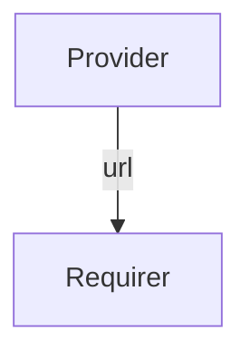

# `sdcore_config`

## Usage

Within SD-Core, the Webui URL needs to be known by other components for the configuration of the SD-Core network. 

Hence, SD-Core NF's need to connect to config server using Webui URL which is consist of Webui Operator hostname which equals to application name and a fixed GRPC port.

The `sdcore_config` relation interface describes the expected behavior of any charm claiming to be able to provide or consume the Webui GRPC address.

In SD-Core network, the provider of this interface would be the Webui operator and the requirer of this interface would be the control plane NF's (AMF, SMF, AUSF, NRF, NSSF, UDM,  UDR, and PCF).

## Direction



As with all Juju relations, the `sdcore_config` interface consists of two parties: a Provider and a Requirer.

## Behavior

Both the Requirer and the Provider need to adhere to criteria to be considered compatible with the interface.

### Provider

- Is expected to provide the Webui GRPC address (Webui hostname and fixed GRPC port).
    

### Requirer

- Is expected to use the the Webui GRPC address.

## Relation Data

[\[Pydantic Schema\]](./schema.py)

#### Example

```yaml
provider:
  app: {
    "webui_url": "sdcore-webui-k8s:9876",
  }
  unit: {}
requirer:
  app: {}
  unit: {}
```
