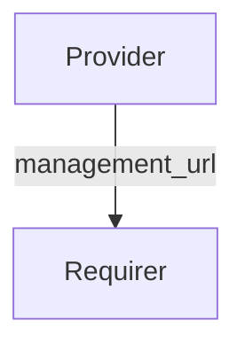

# `sdcore_management`

## Usage

Within Charmed-5G, the components that makes configuration changes to the network require access to the configuration and management service.

The `sdcore_management` relation interface describes the expected behavior of any charm claiming to provide or consume the information to access the configuration service in SD-Core.

SD-Core Webui Operator that is responsible for the configuration of the SD-Core network within Charmed-5G is a typical provider and SD-Core NMS (Network Management System) Operator that provides a user interface to manage and configure the network is a typical requirer of this relation.

## Direction



As with all Juju relations, the `sdcore_management` interface consists of two parties: a Provider and a Requirer.

## Behavior

Both the Requirer and the Provider need to adhere to criteria to be considered compatible with the interface.

### Provider

- Is expected to provide the address to access the SD-Core configuration service endpoint.

### Requirer

- Is expected to use the endpoint address provided to connect to the configuration service.

## Relation Data

[\[Pydantic Schema\]](./schema.py)

#### Example

```yaml
provider:
  app: {
    "management_url": "http://1.2.3.4:1234",
  }
  unit: {}
requirer:
  app: {}
  unit: {}
```
