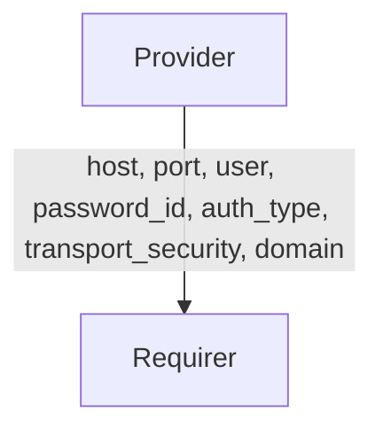
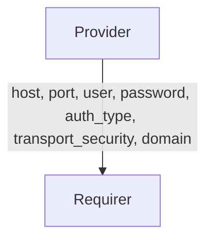

# `smtp`

## Overview

This relation interface describes the expected behavior between of any charm claiming to be able to interface with a SMTP Provider and the SMTP Provider itself.

## Usage

In most cases, this will be accomplished using the [smtp library](https://github.com/canonical/smtp-integrator-operator/blob/main/lib/charms/smtp_integrator/v0/smtp.py), although charm developers are free to provide alternative libraries as long as they fulfil the behavioural and schematic requirements described in this document.

## Direction

The `smtp` interface implements a provider/requirer pattern.
The requirer is a charm that requires SMTP details to connect to an SMTP server, and the provider is a charm holding those details.



or alternatively, if secrets are not supported by both sides



## Behavior

The requirer and the provider must adhere to a certain set of criteria to be considered compatible with the interface.

### Provider

- Is expected to provide the host in the relation databag.
- Is expected to provide the port in the relation databag.
- Is expected to provide the auth_type in the relation databag.
- Is expected to provide the transport_security in the relation databag.

### Requirer

- Is not expected to provide anything

## Relation Data

### Provider

[\[JSON Schema\]](./schemas/provider.json)

Provider provides the SMTP configuration. It should be placed in the **application** databag.

#### Example

```yaml
related-units: {}
application_data: {
  "host": "example.smtp",
  "port": "25",
  "user": "example_user",
  "password_id": "01548499c9233d4612352c989162d940f6a9e6f6d5cc058dfcf66f51575e09c2",
  "auth_type": "plain",
  "transport_security": "tls",
  "domain": "domain",
}
```
