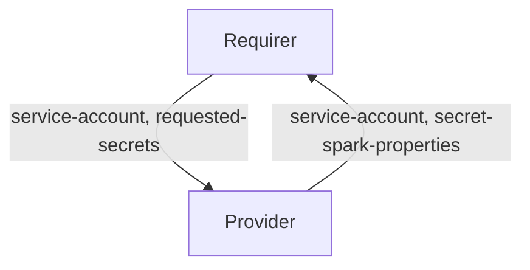

# `spark_service_account`

## Usage

This relation interface describe the expected behavior of any charm claiming to interface with the Charmed Apache Spark solution to provision and use service accounts.

## Direction



The `spark-service-account` relation consists of two parts.
The Provider takes care of creating and managing the Spark service account, while the Requirer can use it to run Spark jobs.

## Behavior

Requirer and Provider must adhere to the following criteria to be considered compatible with this interface.

### Provider

- Is expected to create a Kubernetes service account (and a namespace, if needed) when the requirer provides the `service-account` field.
- Is expected to share the Spark properties Juju Secret URI through the `secret-spark-properties` field of the databag.

### Requirer

- Is expected to provide `requested-secrets`, which is a list of field names that are not to be exposed on the relation databag, but handled within Juju Secrets. It should be JSON parsable array of strings, and correspond to valid Juju Secret keys (i.e. alphanumerical characters with a potential '-' (dash) character). Secret fields must contain `spark-properties`.
- Is expected to provide a namespace and a service account name, separated by a colon, in the `service-account` field.
- TODO: should only relate once? Can tolerate diff between requested sa and granted?

## Relation data

[\[Pydantic Schema\]](./schema.py)

```yaml
provider:
  app:
    service-account: "test-namespace:test-service-account"
    secret-spark-properties: secret://59060ecc-0495-4a80-8006-5f1fc13fd783/cjqub6vubg2s77p3nio0
requirer:
  app:
    service-account: "test-namespace:test-service-account"
    requested-secrets: ["spark-properties"]
```
