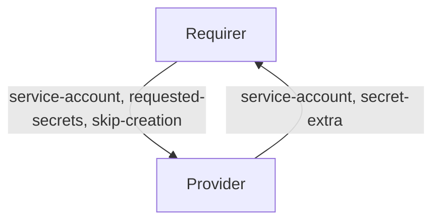

# `spark_service_account`

## Usage

This relation interface describes the expected behavior of any charm that interfaces with the Charmed Apache Spark solution to provision and use service accounts.

## Direction



The `spark-service-account` relation consists of two parts.
The Provider takes care of creating and managing the Spark service account, while the Requirer can use it to run Spark jobs.

## Behavior

Requirer and Provider must adhere to the following criteria to be considered compatible with this interface.

### Provider

- Is expected to create a Kubernetes service account (and a namespace, if needed) when the requirer provides the `service-account` field AND if `skip-creation` is explicitly passed as `false` during relation creation
- Is expected to share the Secret URI containing both the Spark properties and the K8s resource manifest through the `secret-extra` field of the databag.

### Requirer

- Is expected to provide `requested-secrets`, which is a list of field names that are not to be exposed on the relation databag, but handled within Juju Secrets. It should be JSON parsable array of strings, and correspond to valid Juju Secret keys (i.e. alphanumerical characters with a potential '-' (dash) character). Secret fields must contain `spark-properties` and `resource-manifest`.
- Is expected to provide a namespace and a service account name, separated by a colon, in the `service-account` field during relation creation.
- Can opt out the service account creation by the provider side by passing a `true` bool value in the `skip-creation` field during relation creation.

## Relation data

[\[Pydantic Schema\]](./schema.py)

```yaml
provider:
  app:
    service-account: "test-namespace:test-service-account"
    secret-extra: secret://59c8c4df-deca-4d79-83e1-18ff563042d1/d0q6mcvmp25c7650r87g
requirer:
  app:
    service-account: "test-namespace:test-service-account"
    requested-secrets: ["spark-properties", "resource-manifest"]
    skip-creation: false
```
