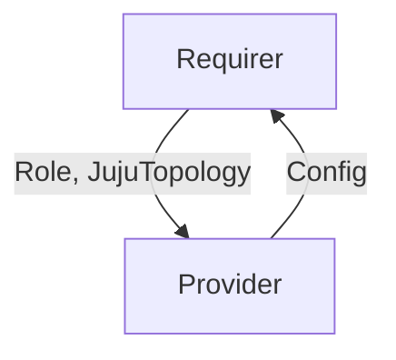

# `tempo_cluster`

## Usage

`tempo_cluster` is an interface meant to exchange cluster configuration in distributed Tempo deployments.
Multiple [Tempo worker](https://github.com/canonical/tempo-worker-k8s-operator) applications can relate to a [Tempo coordinator](https://github.com/canonical/tempo-coordinator-k8s-operator) application over the `tempo_cluster` interface, and send their role and topology, in order to join the cluster.
The coordinator will use the same relation to convey to the workers back the configuration that they must run with.

## Direction

This interface implements a provider/requirer pattern. The coordinator charm is the provider of the relation, the worker charm is the requirer. Information flows back and forth: first the requirer shares some data necessary for the coordinator to know the role of the worker, then the provider replies back with the configuration it should run with and other bits of configuration for the charm to use. 



## Behavior

### Provider
The provider is expected to...
- update the gossip rings in all configurations with the addresses of all worker units that are joining the cluster (regardless of their role).
- share the exact same configuration to all nodes, regardless of the role they declare, via application databag.
- share all other data required by the schema.

### Requirer
The requirer application is expected to...
- publish its role as soon as possible via application databag.  
Each requirer unit is expected to...
- publish its address (fqdn) and JujuTopology as soon as possible, via unit databag.

## Relation Data

[\[Pydantic Schema\]](./schema.py)

#### Example
```yaml
provider:
  app: 
    worker_config: 
      # <a chunk of yaml, conforming to Tempo configuration specification: https://grafana.com/docs/tempo/latest/configuration/#configure-tempo>
  unit: {}
  
requirer:
  app: 
    role: receiver
  unit: 
   juju_topology: 
     model: "mymodel"
     model_uuid: "1231234120941234"
     application: "tempo-receiver"
     charm_name: "tempo-worker-k8s"
     unit: "tempo-receiver/2"
  address: "foo-model0.cluster.local" # fqdn
```
