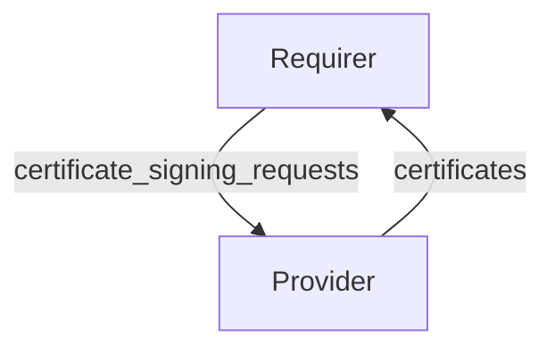

# `tls-certificates/v1`

## Usage

This relation interface describes the expected behavior of any charm claiming to be able to provide
or consume TLS certificates.

A recommended approach is to use the [tls_certificates_interface library V4](https://github.com/canonical/tls-certificates-interface/blob/main/lib/charms/tls_certificates_interface/v4/tls_certificates.py).

## Direction

As with all Juju relations, the `tls-certificates` interface consists of a provider and a requirer.
One of these, in this case the `provider`, will be expected to create TLS certificates where the
`requirer` will be able to consume and use them for TLS communications.



## Behavior

Both the requirer and the provider need to adhere to a certain set of criteria to be considered
compatible with the interface.

### Requirer

- Is expected to generate (or use an existing) private-key
- Is expected to provide a list of CSR's for which it requires certificates
- Is expected to specify whether the certificate request is for a Certificate Authority (CA) or not
- Is expected to use the appropriate databag depending on whether the Certificate is meant to be used by the unit or by the application.
- Is expected to stop using a certificate when revoked by the Provider

### Provider

- Is expected to provide its CA certificate for each CSR
- Is expected to provide its CA chain for each CSR
- Is expected to provide a certificate for each CSR
- Is expected to overwrite the existing certificates and/or remove the pre-existing certificates from the relation data.

## Relation Data

### Requirer

The requirer specifies a set of certificate signing requests (CSR's).

#### Example

```json
{
  "unit-data": {
    "certificate_signing_requests": '[
      {
        "certificate_signing_request": "LS0tLS1CRUdJTiBDRVJUSUZJQ0FURSBSRVFVRVNULS0tLS0KTUlJQ2FUQ0NBVkVDQVFBd0pERUxNQWtHQTFVRUJoTUNWVk14RlRBVEJnTlZCQU1NRENvdVltRnVZVzVoTG1OdgpiVENDQVNJd0RRWUpLb1pJaHZjTkFRRUJCUUFEZ2dFUEFEQ0NBUW9DZ2dFQkFNaDQxVkdjajJ1c2F1L3R6amd3CkVCcEoxM3lCWDYvQUZjL25Na1R4VTYxT2JycldkVjkwQlcwbS9ZVWdxN0VRNWR3UkJIOFB3L3ZFN3NaN0FoVk0KOENncllKTzQxYWxmRTlFcjU2aFNxSlVpeFV2VXNtWUppcUtwTVpjT3QzSW14cnNHRkh2MXBoN0NoL3R1bCtXNgpNY3RXZnYrNWIreGhEYWZMcC8rMUZSQWhYTHlqZkd0ZCsrUTJISzV6ZS9qQUN4YzF3a3pFNmpwTkxwNHJGL1h5CjFKVXdkZDVYVURkWjVmL1JrWWNKaEJ2OHpWbjd0WEYvZ0FOVDc2bHI4ZS82VWZHK0FQUURvL1UrMUdpeG4yL0sKdHVnYVBNRFlBZ2xLYm9JQVh3em9HbEpIR1crcEZZTGU2eGhHTE15RWhCRmJ0a1BKNGRDS0l5Tnh1T29rSHp3Ygp5aDhDQXdFQUFhQUFNQTBHQ1NxR1NJYjNEUUVCQ3dVQUE0SUJBUUNZa0g1aVNhT0dGSnREWHhCd0xRNldxc0JhCnU3VkxhMHJubksrbCtmUjNwV2Q5UThqOG5PTXI4d2szb2FNQ2JFQ3RaSitqYjZEN2Y0aS9IN1BOOElOVzl6S0IKVjltVTh0YnhhRTdub2x0UW9XQTgwU3hSN3BhWWF3Tit0NnNWUTN3aTJyZ3F2aGpGVEJKQStiYmZsQjZRM3FzYgpOSDAwYUo3eTdrU1d1MWxxNkhERnh4L0FlMEZLVUNqQVNrWnhsU0taUEJYcWF1UG9tU3hCMVhGN1pWN244eGtOCjNIcU1UdnhiUDR5bU1RQ1hxaktzN2hBQUVmK0I3UjNHYzdmbnhQRDNMMGREU3dGanJXL2tvZy8wSTRNa1RiaGUKT29FRGdpT09UQmlHaDcvZ3RXTXVXcHBmYys0ckloR1FEMGRLR1NpUVFjL2tPMlExZmNyME1YM0Z0dnUwCi0tLS0tRU5EIENFUlRJRklDQVRFIFJFUVVFU1QtLS0tLQo="
      },
      {
        "certificate_signing_request": "LS0tLS1CRUdJTiBDRVJUSUZJQ0FURSBSRVFVRVNULS0tLS0KTUlJQ2FEQ0NBVkFDQVFBd0l6RUxNQWtHQTFVRUJoTUNWVk14RkRBU0JnTlZCQU1NQ3lvdVltRnVZVzVoTG1OaApNSUlCSWpBTkJna3Foa2lHOXcwQkFRRUZBQU9DQVE4QU1JSUJDZ0tDQVFFQXNKRFFiY0IxZVNwYjRjUmpEZXNWCm1lbmMvT0ZXMEZrcUQ3aUtDVVZmakFjSjdVOGowTTZmZC9FL3o1OFRrY0htQmRqbGlqcitoTStmVWRKMXhpQ3gKanlEMTkwZjU0N2s1RmZkYUFkcFhkaHpQZVJmVWt5MFlwTUY0M1BPVnc3MXhCQm8wQXgvK1RGNE9zd2tBa1J3egpFQVhpZkZTdlhPcUFnNG9BVG9MbVYrclh4cmFidFlBM1VFcGxxRTc2ZVdCdVdJbWpGZ2IzbDVWb25Sc1pPUXE1CjlVNE1aSzhoMi9LeEVqMUpGcFpSNnJteDdiUEZxOUNzbjhYb1V2MlRoRFBvNlNWRXJxUWxSdGNXVVFGSG9Ic2UKK0JUUmI5Q255WW5hdFF5YThaU0Y3QnZ4RFIrY0hyV04vNHhIeW1YdkU2VDJ4STFSN3pqQkZvQ3hISEVaY3MwTgowUUlEQVFBQm9BQXdEUVlKS29aSWh2Y05BUUVMQlFBRGdnRUJBSmNlTTY2SnpwaFVwZm9NY1VNd3NhYU1YczVQCjFEQTFnYkMzOE9sZEkrU2NtMkJxeWlkVmNRVXBaclhBSTdhdUJ1ZzVQUlJmcEpVSWZKSExxYlUraTJJODRwQlAKOG4xR0RKeTg0dGllM2RaVlcvakhzVGQ4QVpNTGJVZkFPZUgxREVWRzdFK0dXWlRtd25UZnJKZnNNSy9mN3Y0YwpxemdsTGpBd29Cbjl5QWhvdVBpU1JZY0Vhdng2bzhVbFpLZFBuQ0tzb240WGV5RUh1cjUwLzlmS05sWlhRMENvCndmQ3E2MzJkQ2Q2L0VyRkpOQTVEemRzVnp3aDZiWXJIU3R0UlFMN012NThpaEEzeVBwN3dUYVg3UTBxK1hvZTEKYksvU1gvT3U3V1pGUXFzZy8raENHZHBxL3NUYy9RaGRBcjNaMTk1NmpiS2k5bjg2d2FzZTdwYjhGcGc9Ci0tLS0tRU5EIENFUlRJRklDQVRFIFJFUVVFU1QtLS0tLQo=",
        "ca": true,
      }
    ]'
  }
}
```

### Provider

The provider replies with a certificate, a CA Certificate and a CA chain for each of the
Certificate Signing Requests requested by the requirer.

#### Example

```json
{
  "application-data": {
    "certificates": '[
      {
        "ca": "LS0tLS1CRUdJTiBDRVJUSUZJQ0FURS0tLS0tCk1JSURNVENDQWhtZ0F3SUJBZ0lVRWg5dWl3Q0tQVXRLaTY3bFd6aFk1ckJoS1dFd0RRWUpLb1pJaHZjTkFRRUwKQlFBd0tERUxNQWtHQTFVRUJoTUNWVk14R1RBWEJnTlZCQU1NRUhKdmIzUmpZUzV3YVhwNllTNWpiMjB3SGhjTgpNakl3TnpJME1UY3lOVE15V2hjTk16SXdOekl4TVRjeU5UTXlXakFvTVFzd0NRWURWUVFHRXdKVlV6RVpNQmNHCkExVUVBd3dRY205dmRHTmhMbkJwZW5waExtTnZiVENDQVNJd0RRWUpLb1pJaHZjTkFRRUJCUUFEZ2dFUEFEQ0MKQVFvQ2dnRUJBSTJ3MGlVbUVrcTR6aWpaNllIcEtmQ1NhaGZuQjZMVTR6SW9YWFhnck9mRzNORkxuMlVpckQ3NgovNzdPSU9SR0k5TGk3czlScEQwZ21hY3lNK0o1S2RBbCsxUzJpWFRLSEhsWU9jd0EzZUZ3V0ZtTFBGY1poSjVJCjQ5b3BhL1NyVXkrMFFsbFlKUTdVSGdNNm1BSncyRUxtd3FPMlJsRGsvWnBDaTdieEtoR2VmcDR6K1l3dGNxVDMKMWduSzBEaE1yNVlYRHNHaDBPVWhjaWdjYmxBRW43bHBYdTREQThDSHpkdTZ5SlRuTmZXSXVSNXRwTHN5WFB3QgpWNzBORmQ0SnV6dW45L2tRZ2s0cmJtYWJYWi9wdzVPZ1NnMzVCTzNlRlU4RkxoM2dpTFRqQXJQOUx2M1hMN0NXCmE4MXMvZkpKK2xaRUs0aEVoUVlSMUc2UDMxRS9mWUVDQXdFQUFhTlRNRkV3SFFZRFZSME9CQllFRko4Qk10MUcKY1QvY1M5QVNFVEgvbW1pRzNhOWJNQjhHQTFVZEl3UVlNQmFBRko4Qk10MUdjVC9jUzlBU0VUSC9tbWlHM2E5YgpNQThHQTFVZEV3RUIvd1FGTUFNQkFmOHdEUVlKS29aSWh2Y05BUUVMQlFBRGdnRUJBQXlERWdpUzIzaUMxM3RwCmtTMFlXOXMyNlk2RnJ4T2FMYVE0RWpPTXE2MkR5aGhKL1lKVjhlbExLd0RGd2NzSXVpMGN4eDBBT3V2TnAxaTQKNUJWYnIvMzN3SlQ5bVBSaklPK2FOWUtQSk9VNmw3UzV5MDBCb0FTekZoaGdVR1Q3aGhTK0crU2ZiTVZ1dUlxUgo1MU9RLzNsOFFBUzVKaWp5akN6cGdwY2tKVldoOUdiV2lYdkFwczMwb3dHdGh1Umpkd1NQUVY2V284eE13M3FkCmF0bDV2ekd0WkVqeG5hRzhtK1ppVkdUbVg4MWtUeVJQN0hlTndRZ3NMSUNQVzQyUThIVnNOL2g3VmVRTVVIdWcKenFrMFpTdWM5aDlpZ3dwc1lDNndpQUoyckxEOE8wRkZYNkV6elZmQlZEbjUxQW9WRklRS256UU1udDF6T1g0YgpPWjV4MStNPQotLS0tLUVORCBDRVJUSUZJQ0FURS0tLS0tCg==",
        "chain": ["LS0tLS1CRUdJTiBDRVJUSUZJQ0FURS0tLS0tCk1JSURNVENDQWhtZ0F3SUJBZ0lVRWg5dWl3Q0tQVXRLaTY3bFd6aFk1ckJoS1dFd0RRWUpLb1pJaHZjTkFRRUwKQlFBd0tERUxNQWtHQTFVRUJoTUNWVk14R1RBWEJnTlZCQU1NRUhKdmIzUmpZUzV3YVhwNllTNWpiMjB3SGhjTgpNakl3TnpJME1UY3lOVE15V2hjTk16SXdOekl4TVRjeU5UTXlXakFvTVFzd0NRWURWUVFHRXdKVlV6RVpNQmNHCkExVUVBd3dRY205dmRHTmhMbkJwZW5waExtTnZiVENDQVNJd0RRWUpLb1pJaHZjTkFRRUJCUUFEZ2dFUEFEQ0MKQVFvQ2dnRUJBSTJ3MGlVbUVrcTR6aWpaNllIcEtmQ1NhaGZuQjZMVTR6SW9YWFhnck9mRzNORkxuMlVpckQ3NgovNzdPSU9SR0k5TGk3czlScEQwZ21hY3lNK0o1S2RBbCsxUzJpWFRLSEhsWU9jd0EzZUZ3V0ZtTFBGY1poSjVJCjQ5b3BhL1NyVXkrMFFsbFlKUTdVSGdNNm1BSncyRUxtd3FPMlJsRGsvWnBDaTdieEtoR2VmcDR6K1l3dGNxVDMKMWduSzBEaE1yNVlYRHNHaDBPVWhjaWdjYmxBRW43bHBYdTREQThDSHpkdTZ5SlRuTmZXSXVSNXRwTHN5WFB3QgpWNzBORmQ0SnV6dW45L2tRZ2s0cmJtYWJYWi9wdzVPZ1NnMzVCTzNlRlU4RkxoM2dpTFRqQXJQOUx2M1hMN0NXCmE4MXMvZkpKK2xaRUs0aEVoUVlSMUc2UDMxRS9mWUVDQXdFQUFhTlRNRkV3SFFZRFZSME9CQllFRko4Qk10MUcKY1QvY1M5QVNFVEgvbW1pRzNhOWJNQjhHQTFVZEl3UVlNQmFBRko4Qk10MUdjVC9jUzlBU0VUSC9tbWlHM2E5YgpNQThHQTFVZEV3RUIvd1FGTUFNQkFmOHdEUVlKS29aSWh2Y05BUUVMQlFBRGdnRUJBQXlERWdpUzIzaUMxM3RwCmtTMFlXOXMyNlk2RnJ4T2FMYVE0RWpPTXE2MkR5aGhKL1lKVjhlbExLd0RGd2NzSXVpMGN4eDBBT3V2TnAxaTQKNUJWYnIvMzN3SlQ5bVBSaklPK2FOWUtQSk9VNmw3UzV5MDBCb0FTekZoaGdVR1Q3aGhTK0crU2ZiTVZ1dUlxUgo1MU9RLzNsOFFBUzVKaWp5akN6cGdwY2tKVldoOUdiV2lYdkFwczMwb3dHdGh1Umpkd1NQUVY2V284eE13M3FkCmF0bDV2ekd0WkVqeG5hRzhtK1ppVkdUbVg4MWtUeVJQN0hlTndRZ3NMSUNQVzQyUThIVnNOL2g3VmVRTVVIdWcKenFrMFpTdWM5aDlpZ3dwc1lDNndpQUoyckxEOE8wRkZYNkV6elZmQlZEbjUxQW9WRklRS256UU1udDF6T1g0YgpPWjV4MStNPQotLS0tLUVORCBDRVJUSUZJQ0FURS0tLS0tCg=="],
        "certificate_signing_request": "LS0tLS1CRUdJTiBDRVJUSUZJQ0FURSBSRVFVRVNULS0tLS0KTUlJQ2FEQ0NBVkFDQVFBd0l6RUxNQWtHQTFVRUJoTUNWVk14RkRBU0JnTlZCQU1NQ3lvdWNHbDZlbUV1WTI5dApNSUlCSWpBTkJna3Foa2lHOXcwQkFRRUZBQU9DQVE4QU1JSUJDZ0tDQVFFQTJNTkVqM2VNelp3Y2NzbE1ld1JDClE1bTdVYko5dDBrUFlhcmNlb0JmOUlyT2Rkd2F1Z012TCtHcnlaMjdMOGE3b2JDMVlHeVV5Uzh4YUpBYkxSamMKY1RDYTJrV2NVMUJ1NnRrTGtyVmhpc1ZHTWNKT3FBek1lRWdrczRQTTU2RndNdFFaSUxKblFDNGd4c21rMnVQTgpMeXpMOFA5MUFZN2twaitLaUVyVEF1cy9PYzZMRW9WcW5pRklZMzZscTlSckdDL1IzOGNqVWRQRnZjU3hGRmYwCmVuSFJtYkNkd1J6ZmZQYzVoT2YwUFl2cCtuKzVQWGcyYjZjRlFvV0FaQTYvQjhTS3IvZmxRTmFEd3cwb2E3WHQKdjlUZSsrNzY2UHB0dDkwU1JVSXRta3FFNkZiaWdqZVlmWUVEWVRPRWwweU9DbzNEUlZUcVptNjFsSFBoUzU4VApnUUlEQVFBQm9BQXdEUVlKS29aSWh2Y05BUUVMQlFBRGdnRUJBRXR4M1BJb2ozRko1VG41czZhU1NobHcwL3VSCkxKQkxYUCtSZUNRNkxTT3NabWpiUE1QVHo2ZVpKejR3cko1Zy9yRmJBeGp1VW03T2pWTUwzNDdkNzNteERVM2cKaENFd1NGN1NMSllwbUl6MnRPNTB1YmdDVFM5UnBZdDNWMkU4TEhVY3piVUhXQmRCUDE1TElTZVRQZWxvRlFIUgppb3I4VElQSHV1N0JGK3dwYlovdVZ0SE5TOUE3K2tlbmtHNjhlN2NJakNTZFl5Q0NaTnZLUkZLYU1IT3dHVWNICkpDZmNmbkErOGo5VUh6S0NTOWNIZjRhQmpBMm9QZ0lVanZCWlNRd0hlQnYzOFVFdXg5VmJRdXdHVHZEYlo3R3QKSFh5RnJRUWRBNW80RmFjMWNCMVhwc2JmbDZXRXNaSUNwOXF0Rmtsb1ZqK3FzbytBY2o0ZFZxQ0hjazg9Ci0tLS0tRU5EIENFUlRJRklDQVRFIFJFUVVFU1QtLS0tLQo=",
        "certificate": "LS0tLS1CRUdJTiBDRVJUSUZJQ0FURS0tLS0tCk1JSURmekNDQW1lZ0F3SUJBZ0lVTWJRVk1uK3JOVjlOUjlCQ1pRRE9CZkg5NkJVd0RRWUpLb1pJaHZjTkFRRUwKQlFBd0tERUxNQWtHQTFVRUJoTUNWVk14R1RBWEJnTlZCQU1NRUhKdmIzUmpZUzV3YVhwNllTNWpiMjB3SGhjTgpNakl3TnpJME1UY3lOVE15V2hjTk1qUXhNREkyTVRjeU5UTXlXakFqTVFzd0NRWURWUVFHRXdKVlV6RVVNQklHCkExVUVBd3dMS2k1d2FYcDZZUzVqYjIwd2dnRWlNQTBHQ1NxR1NJYjNEUUVCQVFVQUE0SUJEd0F3Z2dFS0FvSUIKQVFEWXcwU1BkNHpObkJ4eXlVeDdCRUpEbWJ0UnNuMjNTUTlocXR4NmdGLzBpczUxM0JxNkF5OHY0YXZKbmJzdgp4cnVoc0xWZ2JKVEpMekZva0JzdEdOeHhNSnJhUlp4VFVHN3EyUXVTdFdHS3hVWXh3azZvRE14NFNDU3pnOHpuCm9YQXkxQmtnc21kQUxpREd5YVRhNDgwdkxNdncvM1VCanVTbVA0cUlTdE1DNno4NXpvc1NoV3FlSVVoamZxV3IKMUdzWUw5SGZ4eU5SMDhXOXhMRVVWL1I2Y2RHWnNKM0JITjk4OXptRTUvUTlpK242ZjdrOWVEWnZwd1ZDaFlCawpEcjhIeElxdjkrVkExb1BERFNocnRlMi8xTjc3N3ZybyttMjMzUkpGUWkyYVNvVG9WdUtDTjVoOWdRTmhNNFNYClRJNEtqY05GVk9wbWJyV1VjK0ZMbnhPQkFnTUJBQUdqZ2FVd2dhSXdDUVlEVlIwVEJBSXdBREJWQmdOVkhSRUUKVGpCTWdnc3FMbkJwZW5waExtTnZiWUlQS2k1dWJYTXVjR2w2ZW1FdVkyOXRnaE1xTG5OMFlXZHBibWN1Y0dsNgplbUV1WTI5dGdoY3FMbTV0Y3k1emRHRm5hVzVuTG5CcGVucGhMbU52YlRBZEJnTlZIUTRFRmdRVThWbDBWWFZJCmJiN1lrTm1UTXVVNldlTjVQVDh3SHdZRFZSMGpCQmd3Rm9BVW53RXkzVVp4UDl4TDBCSVJNZithYUliZHIxc3cKRFFZSktvWklodmNOQVFFTEJRQURnZ0VCQUFOc1hBRWZlS3VkSjNpQkhpVHJEZDRoV055cCtvTEVzcEVlQ01pawpQTmdZaGROMGE5bDdRcVU2TVFtWGtXTy9hYzJPN0NrTklmU0UyNHkvOTZ2dXQyRXhLelM3UzR3LzZsempMaFNqCkV3ZUVJQjhvYTZPWVIycmlaakxMV2k4REdrZkw5cFdDcEorU2lzRkpuL1JCa2JvT0VmMDV5U1Y2aCtXNVdrRS8KOUxCU2NxZUJWUDRLelRiQ200S1dmNkc1RjhsQzBGMEZYNGtBY1RtSDhnalRoSzhqYTFNOGIxS1lXTnZzSW43dgo3dG9nNHIzVTk5eGZxRHhLdUxLRFFDclU5Wk9pc1hkVTRFbmwyUzFWaUI2Yld6RW9VekZxVHJBNmpPMUpNdTI3CkhiS3I1Mm5laWp1QndsWTY4VlZDMUpHRU9yQmtDdmxGaFNuS0hET1daOUhpbXVnPQotLS0tLUVORCBDRVJUSUZJQ0FURS0tLS0tCg=="
      }
    ]'
  }
}
```
