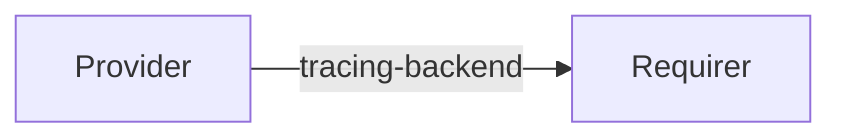

# `tracing`

## Usage

This relation interface is meant to exchange the necessary information for a charm to integrate with a Tempo-compliant tracing backend.

## Direction

Tracing, like certain log systems, is a push-based API.  However, the directionality of the relation flows from the trace ingester (a Tempo(-compliant) backend) to the provider of traces (the applications generating metrics and traces), such as a mattermost charm.

The trace ingester exposes the tracing backend at which traces can be forwarded by the requirer; the requirer receives that data and uses it to determine where to send the traces.

This follows the convention of other push models such as `loki_push_api`.

We call the data structure that is exchanged via this interface 'tracing backend'.



## Behavior
### Provider

- Is expected to publish the hostname at which the server is reachable.
- Is expected to publish, for each protocol it accepts, the port at which the server is listening.

### Requirer

- Is expected to push traces to one or more of the supported endpoints.
- Is expected to handle cases where the ingester ports do not contain a supported ingester type, for instance by blocking. 

## Relation Data
### Provider

The provider exposes via its application databag a single hostname, at which the server is reachable, and a list of `ingester-ports`.
Each ingester port supports a certain tracing protocol, such as OTLP_GRPC or Jaeger. 
The full list of supported trace protocols can change with time, but those supported by Tempo at the time of writing are:

- tempo
- otlp_grpc
- otlp_http
- jaeger
- zipkin

[\[JSON Schema\]](./schemas/provider.json)


#### Example
```yaml
# unit_data: <empty> 
application_data: 
  hostname: "http://foo.bar/my-model-my-unit-0"
  ingester-ports: 
    - type: otlp_grpc
      port: 1234
    - type: otlp_http
      port: 5678
```

### Requirer

The requirer side is not expected to publish any data via this relation's databags.
[\[JSON Schema\]](./schemas/requirer.json)
