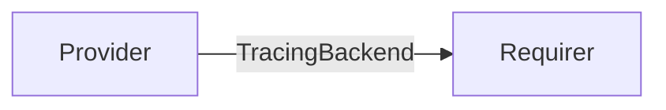

# `tracing`

## Usage

This relation interface is meant to exchange the necessary information for a charm to integrate with a Tempo-compliant tracing backend.

## Direction

Tracing is a push-based system. The tracing backend, also called an ingester, can support a number of different protocols, such as [otlp-grpc](https://github.com/open-telemetry/opentelemetry-specification/blob/main/specification/protocol/otlp.md#otlpgrpc) or [otlp-http](https://github.com/open-telemetry/opentelemetry-specification/blob/main/specification/protocol/otlp.md#otlphttp).
The tracing backend **provides**, for each protocol it supports, an endpoint at which the server is ready to accept that protocol. So the directionality of the relation flows from the observer: the trace ingester (a Tempo(-compliant) backend), to the observed: the application producing the traces, such as a mattermost charm.

The requirer is supposed to receive the supported protocols and use it to determine where to send the traces.

This follows the convention of other push models such as `loki_push_api`.

We call the data structure that is exchanged via this interface 'tracing backend'.



## Behavior
### Provider

- Is expected to publish the hostname at which the server is reachable.
- Is expected to run a server supporting one or more tracing protocols such as [OTLP](https://github.com/open-telemetry/opentelemetry-specification/blob/main/specification/protocol/otlp.md#opentelemetry-protocol-specification).
- Is expected to publish via relation data, for each protocol it accepts, the port at which the server is listening.


### Requirer

- Is expected to push traces to one or more of the supported endpoints.
- Is expected to handle cases where none of the protocols offered by the provider is supported. 

## Relation Data
### Provider

The provider exposes via its application databag a single hostname, at which the server is reachable, and a list of `ingester-ports`.
Each ingester port supports a certain tracing protocol, such as OTLP_GRPC or Jaeger. 
The full list of supported trace protocols can change with time, but those supported by Tempo at the time of writing are:

- tempo
- otlp_grpc
- otlp_http
- jaeger
- zipkin

[\[JSON Schema\]](./schemas/provider.json)


#### Example
```yaml
# unit_data: <empty> 
application_data: 
  hostname: "http://foo.bar/my-model-my-unit-0"
  ingester-ports: 
    - type: otlp_grpc
      port: 1234
    - type: otlp_http
      port: 5678
```

### Requirer

The requirer side is not expected to publish any data via this relation's databags.
[\[JSON Schema\]](./schemas/requirer.json)
