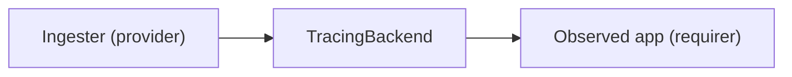

# `tracing`

## Usage

This relation interface describes the expected behavior of any charm claiming to be able to provide or consume a tempo-compliant tracing server.

## Direction

Tracing is done in a push-based fashion.
The receiving endpoint of the tracing backend, also referred to as an ingester, can support a number of different protocols, such as [otlp-grpc](https://github.com/open-telemetry/opentelemetry-specification/blob/main/specification/protocol/otlp.md#otlpgrpc) and [otlp-http](https://github.com/open-telemetry/opentelemetry-specification/blob/main/specification/protocol/otlp.md#otlphttp).
The tracing backend exposes, for each protocol it supports, an endpoint at which the server is ready to accept that protocol. 
The directionality of the relation flows from the observer, Tempo(-compliant) backend, to the observed: the application producing the traces.

We call the data structure that is exchanged via this interface the 'TracingBackend'.



## Behavior
### Requirer

- Is expected to push traces to one or more of the supported endpoints.
- Is expected to handle cases where none of the protocols offered by the provider is supported. 

### Provider

- Is expected to publish the url at which the server is reachable.
- Is expected to run a server supporting one or more tracing protocols such as [OTLP](https://github.com/open-telemetry/opentelemetry-specification/blob/main/specification/protocol/otlp.md#opentelemetry-protocol-specification).
- Is expected to publish, for each protocol it accepts, the port at which the server is listening along with the name of the supported protocol.


## Relation Data
### Provider

The provider exposes via its application databag a single `url`, at which the server is reachable, and a list of `ingesters` = ports and protocols.
Each ingester port supports a certain tracing protocol, such as OTLP_GRPC or Jaeger. 
The full list of supported trace protocols can change, but those supported by Tempo at the time of writing are:

- `tempo`
- `otlp_grpc`
- `otlp_http`
- `jaeger`
- `zipkin`

[\[Pydantic model\]](./schema.py)


#### Example
```yaml
# unit_data: <empty> 
application_data: 
  url: "http://foo.bar/my-model-my-unit-0"
  ingesters: 
    - protocol: otlp_grpc
      port: 1234
    - protocol: otlp_http
      port: 5678
```

### Requirer

The requirer side is not expected to publish any data via this relation's databags.
