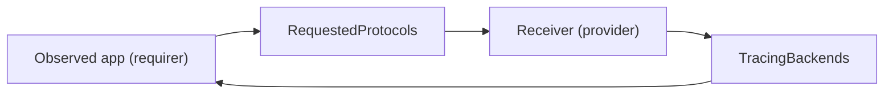

# `tracing`

## Usage

This relation interface describes the expected behavior of any charm claiming to be able to provide or consume a tempo-compliant tracing server.

## Direction

Tracing is done in a push-based fashion.
The receiving endpoint of the tracing backend, also referred to as a _receiver_, can support a number of different protocols, such as [otlp-grpc](https://github.com/open-telemetry/opentelemetry-specification/blob/main/specification/protocol/otlp.md#otlpgrpc) and [otlp-http](https://github.com/open-telemetry/opentelemetry-specification/blob/main/specification/protocol/otlp.md#otlphttp).
The requirer initializes the interface by publishing a list of receiver protocols it intends to use to send traces to the provider.
The provider replies with, for each requested interface, an endpoint at which the server is ready to accept that protocol. If the provider does not support a requested interface, it will omit that from the response. This entails that if no requested protocol is supported, the reply may contain no protocol-specific receiver ports (it will still contain the API url).

The directionality of the relation flows from the observer, Tempo(-compliant) backend, to the observed: the application producing the traces.



## Behavior
### Requirer

- Is expected to publish a list of one or more protocols it wishes to use to send traces.
- Is expected to await receiving from the provider a list of endpoints.
- Is expected to push traces to one or more of the provided endpoints using the corresponding encoding/protocol.
- Is expected to handle cases where none of the requested protocols is supported. 

### Provider

- Is expected to publish the url at which the server is reachable. (This will happen in any case and doubles down as an acknowledgement of receipt)
- Is expected to comply as good as possible with the requested protocols, activating the corresponding receivers.
- Is expected to run a server accepting trace submissions on **all** the supported **and** requested tracing protocols.
- Is expected to publish, for each protocol it accepts, the port at which the server is listening along with the name of the supported protocol.


## Relation Data

### Requirer

The requirer publishes a list of protocols it needs.
For examples, see below.

[\[Pydantic model\]](./schema.py)


#### Example
```yaml
# unit_data: <empty> 
application_data: 
  receivers: 
    - otlp_grpc
    - otlp_http
```


### Provider

The provider exposes via its application databag a list of `receivers`.
A `receiver` consists of a `url`, a `protocol` object that consists of `name`, which is the telemetry protocol that the `url` accepts, and the `type` of the protocol used, such as `http` or `grpc`. 
The full list of supported trace protocols can change. For a full list see https://github.com/open-telemetry/opentelemetry-collector-contrib/tree/main/receiver

[\[Pydantic model\]](./schema.py)


#### Example
```yaml
# unit_data: <empty> 
application_data:            
  receivers:
    - protocol: 
        name: otlp_http
        type: http
      url: http://traefik_address:2331
    - protocol: 
        name: otlp_grpc
        type: grpc
      url: traefik_address:2331
```
