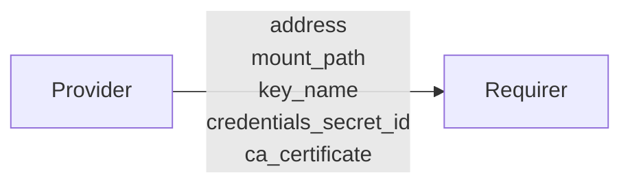

# `vault-autounseal`

## Usage

This relation interface describes the expected behavior of a charm that integrates with the Vault Transit backend to auto-unseal a vault over the `vault-autounseal` relation.

## Data Flow



## Behavior

Both the Requirer and the Provider need to adhere to criteria to be considered compatible with the interface. Specifically, the Provider has some operations to perform, and data to provide to the Requirer. The Requirer on the other hand, must configure Vault to auto-unseal based on the data provided by the Provider.

### Provider

The Provider is expected to

- create a `transit` backend to use for auto-unseal if one does not already exist
- create an encryption key for the requirer called `charm-autounseal/keys/${relation_id}` in the `charm-autounseal` backend
- create a policy for the requirer that provides `update` capabilities on the encryption key
- create an AppRole for this policy, and a secret for the AppRole, and store both the role ID and the secret ID in a Juju secret
  - The secret should contain at least two key-value pairs: `role-id`, and `secret-id`
  - The AppRole should allow the creation of periodic tokens, so that Vault can indefinitely renew the token.
- provide the following to the Requirer in the databag
  - the URL of the Vault (used in the Vault config for the `address` value)
  - the mount path of the transit backend that will be used for auto-unseal
  - the key name of the transit key used for auto-unseal
  - the Juju secret ID which contains the Role ID and Secret ID of the AppRole
  - the CA certificate that the Requirer should use to validate its certificate.

### Requirer

The Requirer is expected to

- retrieve the AppRole credentials (Role ID and Secret ID) from the Juju secret that was identified by the Provider
- create a new token from the AppRole credentials
- configure Vault using a `seal "transit"` stanza and in the Vault config
  - set the `address` to the address provided in the databag
  - set the `mount_path` to the mount path provided in the databag
  - set the `key_name` to the key name provided in the databag
  - set the token to the one created from the AppRole credentials
  - store the CA certificate locally, and set the CA certificate path

## Relation Data

[\[Pydantic Schema\]](./schema.py)

### Example

```yaml
provider:
  app:
    address: https://10.152.183.217:8200
    mount_path: charm-autounseal
    key_name: 2
    ca_certificate: |
      -----BEGIN CERTIFICATE-----
      MIIDTzCCAjegAwIBAgIUaM2XIUnDwnkcHJkeTF0aV91vMukwDQYJKoZIhvcNAQEL
      BQAwLDELMAkGA1UEBhMCVVMxHTAbBgNVBAMMFFZhdWx0IHNlbGYgc2lnbmVkIENB
      MCAXDTI0MDUwMjE2NTcwMFoYDzIwNzQwNDIwMTY1NzAwWjAsMQswCQYDVQQGEwJV
      UzEdMBsGA1UEAwwUVmF1bHQgc2VsZiBzaWduZWQgQ0EwggEiMA0GCSqGSIb3DQEB
      AQUAA4IBDwAwggEKAoIBAQCRXong+2SsJoM4ixWHeGwMmQSrRZsIm37a3ID4G61K
      +NeusiC//EDifY755SVjB881UByk1eccmhnRkuxIJWKG/SdtNsrP/aRWhLHqjsi6
      aFqtoXbh0HbfgaifHgR8o5zfDg5EGR0In9nXIzuWkWb7qoI1Tp4A+sSAPEeJ5Vy5
      D++m904/PcGpidwzDClvKKwmKot3Bm7LpiQkVmWESTlwVEDdwgwBn4tJKipiOxP1
      mPI82H9MpbAEOPwveG1nPWHfeeNbCy35O31ENPeD/GZeCT/6YRZa9a8pqXO5i1HG
      wyYFPIVSNinLkoiwPh8+In5j35O/tUgG0Nn+dkUcpsFFAgMBAAGjZzBlMB8GA1Ud
      DgQYBBYEFCOVrSSP6l3V1p1523yIOlo96dYVMCEGA1UdIwQaMBiAFgQUI5WtJI/q
      XdXWnXnbfIg6Wj3p1hUwDgYDVR0PAQH/BAQDAgKkMA8GA1UdEwEB/wQFMAMBAf8w
      DQYJKoZIhvcNAQELBQADggEBACXbn4RZmgf7Ct/xz/P1FDY+VLx3mhbwCzg0tmax
      UCdmrtJnTSmk6dPQrvdyFRch98Un1ZkvuIORe4s5KLR1+FL7azDY35lPZC7uL9e2
      VyRWqwq6n1rxVO2KgGtNWAwEET+/XSg2M9dAsm4TSzNMB598zy+GezLAym+UXLCX
      RMPIMvtGk9dLFrCZTZ86fOCZWtSr3n820gV8yg1YhSHDO9R+rmeD0iSj7QOs8L0O
      jWpoal3C6/rrAL1auX0vhoOXZ3J3nYoypSYL1SgiKn8hHGLAq/FulOWTxHok7CLy
      4ZT7j4CUoxXdfuAZxQ+cnCyPkpL96y9XsDiescRInOkVAmw=
      -----END CERTIFICATE-----
    credentials_secret_id: secret://575cd150-f7c2-4710-88a3-3f33e14e867c/copsdgnmp25c77tkgke0
```

## Limitations

The interface only supports using the `transit` backend for auto-unseal. Other auto-unseal methods exist, but are not considered in this iteration, as they require external collaborators which fall outside of the charm ecosystem, and require the enterprise version of Vault.

Additionally, this version of the interface focuses purely on using the transit backend for auto-unseal, although there are other legitimate uses of using the transit backend. There may be a need for a more general-purpose `vault-transit` integration in the future.
