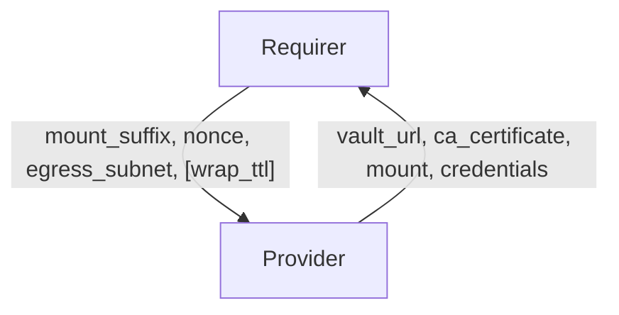

# `vault-kv`

## Usage

Some charms require a secure key value store. This relation interface describes the expected behavior of any charm claiming to interact with Vault Key Value stores.

## Direction



## Behavior

Both the Requirer and the Provider need to adhere to criteria to be considered compatible with the interface.

### Provider

Provider expectations

- Is expected to provide the vault url.
- Is expected to provide a ca certificate used to validate the vault server's certificate.
- Is expected to provide a key value mount, the mount name shall respect the following pattern: `charm-<requirer app>-<requirer provided suffix>`
- Is expected to create an approle restricted to the requiring unit's egress subnet.
- Is expected to create a Juju secret containing a role-id and role-secret-id for each unit. If `wrap_ttl` is requested by the Requirer, the Provider is expected to return a response-wrapping token instead of the `role-secret-id`. The response-wrapping token must contain the response of the POST `/auth/approle/role/:role_name/secret-id` API call. More information about wrapping tokens can be found in Vault [docs](https://developer.hashicorp.com/vault/docs/concepts/response-wrapping).
- Is expected to provide the Juju secret ID in the relation data, identified by the unit's nonce.
- Is expected to have out of date credentials when requirer unit's identity change, for some unspecified amount of time
  until new credentials have been generated. For example, during an upgrade-charm event.

### Requirer

Requirer expectations

- Is expected to provide a mount suffix.
- Is expected to provide the egress subnets for each unit requiring access to the vault key value store.
  The unit's egress_subnet shall be used to restrict access to the secret backend.
  The egress_subnet field should contain a string of all desired addresses separated by commas, using CIDR notation.
- Is expected to provide a nonce, i.e. a string uniquely identifying the unit.
- Is expected to optionally provide a `wrap_ttl` to request the `role-secret-id` being returned as a response-wrapping token with desired TTL.

## Relation Data

[\[Pydantic Schema\]](./schema.py)

#### Example

```yaml
provider:
  app:
    vault_url: http://10.152.183.104:8200
    mount: charm-barbican-secrets # in case of CMR, mount will look like `charm-remote-fd7bc6a8c2d54d748ec3822da5abf0bc-secrets`
    ca_certificate: |
      -----BEGIN CERTIFICATE-----
      MIIDPzCCAiegAwIBAgIUSV4nLL94rCgtxIHB1kyCDh2SBnkwDQYJKoZIhvcNAQEL
      BQAwLDELMAkGA1UEBhMCVVMxHTAbBgNVBAMMFFZhdWx0IHNlbGYgc2lnbmVkIENB
      MCAXDTIzMDkxNTEzMzAzM1oYDzIwNzMwOTAyMTMzMDMzWjAsMQswCQYDVQQGEwJV
      UzEdMBsGA1UEAwwUVmF1bHQgc2VsZiBzaWduZWQgQ0EwggEiMA0GCSqGSIb3DQEB
      AQUAA4IBDwAwggEKAoIBAQC1Odkv2Yv6PoDTT4VPO8EGwlhmbkYib4VbxZVCxQe/
      1qp4IDDKwN4PXnmCbfg/Ri+A8C9CQZirVam0zIxqQJ2fe0EKBO7y7BM8HrhWPh2p
      3oWV3mi8qm1frQvjpWK859oQMFzDkaKGLHIADwi8pr7wLlyUAlGZ6s/aKAtAkRUZ
      fLpUkMpSuoBT/3JgbvQOk9QQS+I0lLsaPxE4KV1kfuH/EdAgiMeqj0Y2Cj0t0ZBG
      ZWt6jOFRffZbDmV/P2Vl0Oc7dJFfluWTy+3GA+AMlaNOVR1xdtmSot+W9dZR7rHp
      dCGeulRjm79DgkCBZ8XNGUDSd5kBv4dkNVXtY24ZCP45AgMBAAGjVzBVMB8GA1Ud
      DgQYBBYEFKbR1+Rgj49n7dHWsrsF+US8FI2GMCEGA1UdIwQaMBiAFgQUptHX5GCP
      j2ft0dayuwX5RLwUjYYwDwYDVR0TAQH/BAUwAwEB/zANBgkqhkiG9w0BAQsFAAOC
      AQEAjFZKJQ/Vo1TtPBfD3A+3NI0jbjEt7i2+ERHfrDSAVZEuV10X7Red/YRd+lup
      rPwgZr1Fg5/dDwiILwOcQz39Qq3u6BFChjH47Oz4krcG5uv6VTrDwhSnmV5gzTia
      hXR6SET/yOwwoM6AWRsvjZQ0jCdRcvd5e+rafM27jXRBO0/F9XQGc3Dn5WM0TalC
      S293oLoL3epU0X36FFRVWMVOCPBVzUS0eRrL90gTWxBNEw4YPyxIZD1+0uhUdJum
      q9IJGysn/ETTPHj83pM+Dgr3+3rP8NP3OF81eKi87nGyrY+HtzlKUTCYymyeCUqK
      CnYvDG4IK/MIkjgiBBTS7diP/A==
      -----END CERTIFICATE-----
    credentials: |
      {
        "3081279da89c48a32923473c2c587019": "secret://4f7cc474-a23d-49a2-8b6e-9835c1e08325/cjk5slcrl3uc767oebp0",
        "b49e6098f245344f1035c3aa0e0c9181": "secret://4f7cc474-a23d-49a2-8b6e-9835c1e08325/cjk5slcrl3uc767oebpg"
      }
  unit: {}
requirer:
  app:
    mount_suffix: secrets
  unit:
    barbican-0:
      egress_subnet: "10.1.166.206/32,10.1.1.0/32"
      nonce: 3081279da89c48a32923473c2c587019
    barbican-1:
      egress_subnet: "10.1.166.230/32"
      nonce: b49e6098f245344f1035c3aa0e0c9181
```
