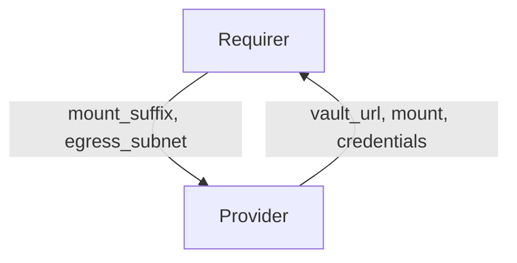

# `vault-kv`

## Usage

Some charms require a secure key value store. This relation interface describes the expected behavior of any charm claiming to interact with Vault Key Value stores.

## Direction



## Behavior

Both the Requirer and the Provider need to adhere to criteria to be considered compatible with the interface.

### Provider

Provider expectations

- Must provide the vault url
- Must provide a key value mount, the mount name shall respect the following pattern: charm-<requirer app>-<user provided suffix>
- Must provide a role_id and role_secret_id for each unit, with access protected by unit's egress_subnet

### Requirer

Requirer expectations

- Must provide a mount suffix
- Must provide an egress subnet for each unit used to protect access to the secret backend

## Relation Data

[\[Pydantic Schema\]](./schema.py)

#### Example

```yaml
provider:
  app:
    vault_url: http://10.152.183.104:8200
    mount: charm-barbican-secrets
    credentials: |
      {
        "barbican-0": {
          "role_id": 158778a2-04fc-39c5-ba13-0cb5faddb5eb",
          "role_secret_id": "41c3e4eb-39ec-5c68-2f41-fbc1bc1e9c52"
        },
        "barbican-1": {
          "role_id": "38eb72db-60d0-082a-4847-6b9d1690cf02",
          "role_secret_id": "fa1db047-3c90-e614-7ca0-76ce2ec1b6fc"
        }
      }
  unit: {}
requirer:
  app:
    mount_suffix: secrets
  unit:
    barbican-0:
      egress_subnet: 10.1.166.206/32
    barbican-1:
      egress_subnet: 10.1.166.230/32
```
