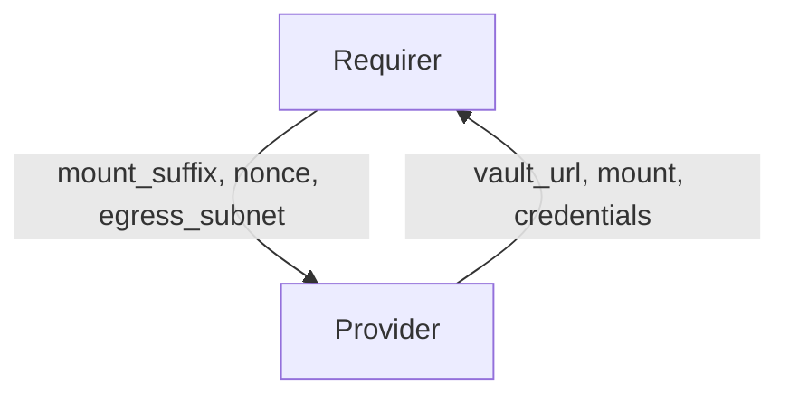

# `vault-kv`

## Usage

Some charms require a secure key value store. This relation interface describes the expected behavior of any charm claiming to interact with Vault Key Value stores.

## Direction



## Behavior

Both the Requirer and the Provider need to adhere to criteria to be considered compatible with the interface.

### Provider

Provider expectations

- Is expected to provide the vault url
- Is expected to provide a key value mount, the mount name shall respect the following pattern: `charm-<requirer app>-<requirer provided suffix>`
- Is expected to create an approle restricted to the requiring unit's egress subnet.
- Is expected to create a Juju secret containing a role-id and role-secret-id for each unit
- Is expected to provide the Juju secret ID in the relation data, identified by the unit's nonce.
- Is expected to have out of date credentials when requirer unit's identity change, for some unspecified amount of time
  until new credentials have been generated. For example, during an upgrade-charm event.

### Requirer

Requirer expectations

- Is expected to provide a mount suffix
- Is expected to provide an egress subnet for each unit requiring access to the vault key value store.
  The unit's egress_subnet shall be used to restrict access to the secret backend.
- Is expected to provide a nonce, i.e. a string uniquely identifying the unit.

## Relation Data

[\[Pydantic Schema\]](./schema.py)

#### Example

```yaml
provider:
  app:
    vault_url: http://10.152.183.104:8200
    mount: charm-barbican-secrets # in case of CMR, mount will look like `charm-remote-fd7bc6a8c2d54d748ec3822da5abf0bc-secrets`
    credentials: |
      {
        "3081279da89c48a32923473c2c587019": "secret://4f7cc474-a23d-49a2-8b6e-9835c1e08325/cjk5slcrl3uc767oebp0",
        "b49e6098f245344f1035c3aa0e0c9181": "secret://4f7cc474-a23d-49a2-8b6e-9835c1e08325/cjk5slcrl3uc767oebpg"
      }
  unit: {}
requirer:
  app:
    mount_suffix: secrets
  unit:
    barbican-0:
      egress_subnet: 10.1.166.206/32
      nonce: 3081279da89c48a32923473c2c587019
    barbican-1:
      egress_subnet: 10.1.166.230/32
      nonce: b49e6098f245344f1035c3aa0e0c9181
```
