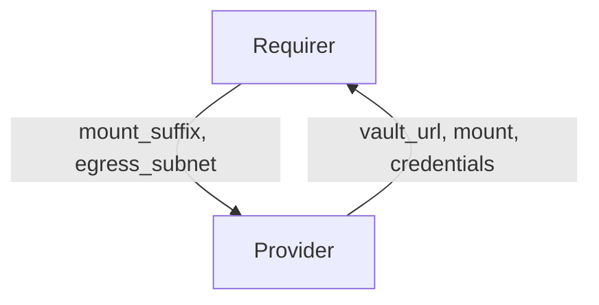

# `vault-kv`

## Usage

Some charms require a secure key value store. This relation interface describes the expected behavior of any charm claiming to interact with Vault Key Value stores.

## Direction



## Behavior

Both the Requirer and the Provider need to adhere to criteria to be considered compatible with the interface.

### Provider

Provider expectations

- Must provide the vault url
- Must provide a key value mount, the mount name shall respect the following pattern: `charm-<requirer app>-<user provided suffix>`
- Must create an approle restricted to the requiring unit's egress subnet.
- Must create a Juju secret containing a role-id and role-secret-id for each unit
- Must provide the Juju secret ID in the relation data.

### Requirer

Requirer expectations

- Must provide a mount suffix
- Must provide an egress subnet for each unit requiring access to the vault key value store.
  The unit's egress_subnet shall be used to restrict access to the secret backend.

## Relation Data

[\[Pydantic Schema\]](./schema.py)

#### Example

```yaml
provider:
  app:
    vault_url: http://10.152.183.104:8200
    mount: charm-barbican-secrets
    credentials: |
      {
        "barbican-0": "secret://4f7cc474-a23d-49a2-8b6e-9835c1e08325/cjk5slcrl3uc767oebp0",
        "barbican-1": "secret://4f7cc474-a23d-49a2-8b6e-9835c1e08325/cjk5slcrl3uc767oebpg"
      }
  unit: {}
requirer:
  app:
    mount_suffix: secrets
  unit:
    barbican-0:
      egress_subnet: 10.1.166.206/32
    barbican-1:
      egress_subnet: 10.1.166.230/32
```
