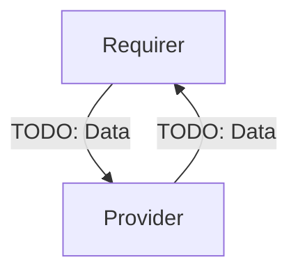

# `vault-transit`

## Usage

This relation interface describes the expected behavior of a charm that integrates with the Vault Transit backend over the `vault-transit` relation.

## Direction

## Behavior

Both the Requirer and the Provider need to adhere to criteria to be considered compatible with the interface.

### Provider

The Provider is expected to

- create a `transit` backend with the path `charm-transit` if it does not already exist
- create an encryption key for the requirer called `charm-transit/keys/${relation_id}` in the `charm-transit` backend
- create a policy for the requirer that provides `update` capabilities on the encryption key
- create a token for this policy, and store it in a Juju secret
  - The secret should contain at least one value: `token`
- provide the Juju secret ID to the Requirer
- provide the URL of the Vault (used in the Vault config for the `address` value)

### Requirer

The Requirer is expected to

- retrieve the token from the Juju secret provided by the Requirer
- use the token to configure Vault using a `seal "transit"` stanza

## Relation Data

[\[Pydantic Schema\]](./schema.py)

#### Example

TODO
