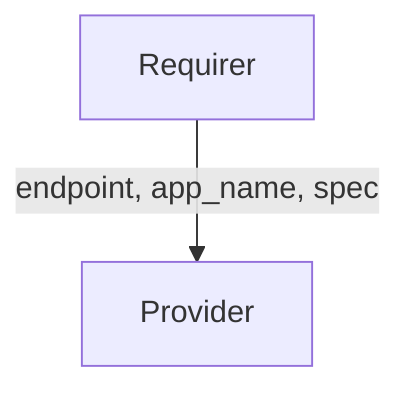

# `velero_backup_config`

## Overview

The `velero-backup-config` interface enables a **Velero client charm** to specify what Kubernetes data should be backed up by relating to a **Velero Operator charm**. In practice, a client charm (such as a Kubeflow component) declares the namespaces and resource types to include or exclude in backups, and the Velero Operator uses this specification to perform the actual backup operations. This design lets the client define backup requirements **without direct cluster elevated permissions**, delegating the backup execution to the Velero Operator charm.

This interface is used by charms like **Velero Kubeflow client** (e.g. `velero-kubeflow`) and the Velero Operator. For example, the Velero Kubeflow client charm defines multiple relation endpoints (e.g. `profiles-backup`, `crds-backup`, `controlplane-backup`) using the `velero-backup-config` interface. Each such relation carries a backup spec for a category of Kubeflow data, and they all connect to the Velero Operator’s single `velero-backups` provider endpoint. [The Velero Operator](https://github.com/canonical/velero-operator) can handle multiple concurrent `velero-backup-config` relations from various clients, distinguishing them by the client application name and relation endpoint.

## Direction

This is a unidirectional interface where the requirer (client) sends data and the provider (Velero Operator) only receives data. There is no data sent back from the provider side.



## Behavior

- **Requirer (Client Charm)**: Provides the backup specification via its application relation data. Typically, a client charm will set this data as soon as the relation is formed.
- **Provider (Velero Operator Charm)**: Consumes the spec. It does not send any data over the relation. The operator charm listens for changes to the relation data and, when a backup is triggered (e.g. via an action), it uses the received spec to create a Velero Backup K8s Custom Resource for execution.

## Relation Data

[\[Pydantic Schema\]](./schema.py)

On the requirer side, the application data bag must contain structure with the following fields:

- `app` (string, required): Name of the client application that requires backups (e.g., "kubeflow" or the name of the charm using this spec).
- `relation_name` (string, required): Name of the relation on the client side through which this spec is sent (for example, "profiles-backup" or other backup scope name, from metadata.yaml).
- `spec` (dict, required): A dictionary defining what to back up. This mirrors Velero’s Backup spec fields and includes the following keys:
  - `include_namespaces` (list of str, optional): Specific Kubernetes namespaces to include in the backup. If set, only these namespaces will be backed up; if not provided or set to null/None, all namespaces are included.
  - `include_resources` (list of str, optional): Specific Kubernetes resource kinds to include in the backup. Typically high-level resources (Deployments, Services, custom resource kinds, etc.) that should be captured. If not specified, all resource types are included.
  - `exclude_namespaces` (list of str, optional): Namespaces to exclude from the backup. This can further narrow down the scope by omitting certain namespaces. If not set, no namespaces are excluded (unless implicitly excluded by Velero defaults).
  - `exclude_resources` (list of str, optional): Resource kinds to exclude from the backup. If not set, no resource types are explicitly excluded.
  - `include_cluster-resources` (bool): Whether to include cluster-scoped resources (like Nodes, PersistentVolumes, etc.) in the backup. Defaults to `False`
  - `label_selector` (dict, optional): A label selector to filter resources for backup. This allows specifying a subset of resources based on labels (e.g., `{"app": "kubeflow"}`) to further refine what gets backed up.
  - `ttl` (string, optional): Time-to-live duration for the backup (how long the backup should be retained before garbage-collection). If not provided, Velero will use its default (e.g. 30 days). This should be a duration string recognized by Velero (for example, "72h" for 3 days, "30d" for 30 days, etc.).

### Requirer

#### Example

```yaml
  application-data:
    app: kubeflow
    relation_name: profiles-backup
    spec:
        include_namespaces: ["kubeflow"]
        include_resources: ["profiles.kubeflow.org"]
        exclude_resources: null             # no excluded resource types
        exclude_namespaces: null            # no excluded namespaces
        label_selector: {"app": "kubeflow"}
        include_cluster_resources: false    # do not include cluster-scoped resources
        ttl: null                           # use Velero default retention
```

### Provider

N/A
