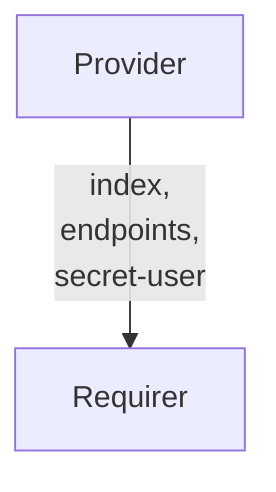

# `wazuh_api_client`

## Usage

This relation interface describes the expected behaviour of any charm interfacing with the Wazuh Sever charm, such as the [Wazuh Server Operator](https://github.com/canonical/wazuh-server-operator) using the `wazuh-api-client` relation.

## Direction



As with all Juju relations, the `wazuh-api-client` interface consists of two parties: a Provider (Wazuh server charm), and a Requirer (application charm). The Provider will provide API credentials, which can be used to access the Wazuh REST API itself.

## Behavior

Both the Requirer and the Provider need to adhere to criteria to be considered compatible with the interface.

Sensitive information is transmitted through Juju Secrets rather than directly through the relation data bag(s). Corresponding pieces of information are grouped together in a single secret.

### Provider
- Is expected to provide credentials (`username` and `password`) in a Juju Secret.
- Is expected to expose the Juju Secrets URI to the credentials through the `secret-user` field of the data bag.
- Is expected to provide the `endpoints` field containing all cluster endpoint addresses in a comma-separated list.

### Requirer

The requirer isn't expected to provide any data.

## Relation Data

### Provider

[\[JSON Schema\]](./schemas/provider.json)

Provider provides credentials and endpoint addresses fields in the **application** databag.


#### Example
```yaml
  relation-info:
  - endpoint: wazuh-api-client
    related-endpoint:  wazuh-api-consumer
    application-data:
      endpoints: 10.180.162.200:55000,10.180.162.75:55000
      secret-user: secret://59060ecc-0495-4a80-8006-5f1fc13fd783/cjqub6vubg2s77p3nio0
```
