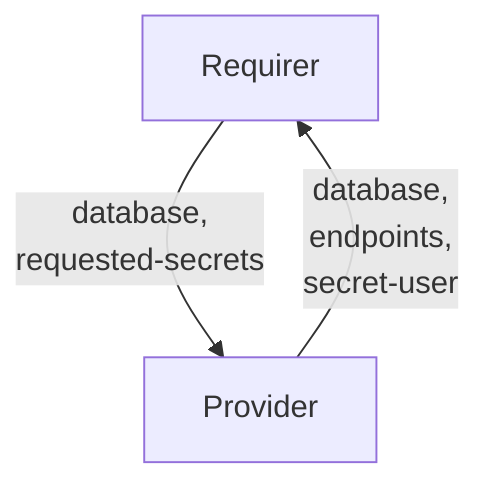

# `zookeeper`

## Usage

This relation interface describes the expected behavior of any charm claiming to be able to interface with a Zookeeper cluster.

## Direction



## Behavior

Both the Requirer and the Provider need to adhere to criteria to be considered compatible with the interface.

### Provider

- Is expected to create an application user inside the database cluster when the requirer provides the `database` field.
- Is expected to provide credentials (`username` and `password`) in a Juju Secret whenever the Requirer supplies the `database` field.
- Is expected to expose the Juju Secrets URI to the credentials through the `secret-user` field of the data bag.
- Is expected to provide the `endpoints` field with a comma-separated list of server uris and zNode.
- Is expected to provide the `database` field with the zNode that was actually created.
- Is expected to provide the `version` field whenever database charm wants to communicate its database version.
- Is expected to provide the CA chain in the `tls-ca` field of a Juju Secret, whenever the provider has TLS enabled (such as using the [TLS Certificates Operator](https://github.com/canonical/tls-certificates-operator)).
- Is expected to share the TLS Juju Secret URI through the `secret-tls` field of the databag.
- If the Requirer asks for additional secrets (via `requested-secrets`, see below) other than those stored in the `user` and `tls` secrets, Provider is expected to define a `secret-extra` field holding the URI of the Juju Secret containing all additional secret fields.

### Requirer

- Is expected to provide `requested-secrets`, which is a list of field names that are not to be exposed on the relation databag, but handled within Juju Secrets. It should be JSON parsable array of strings, and correspond to valid Juju Secret keys (i.e. alphanumerical characters with a potential '-' (dash) character). Secret fields must contain `username` and `password` (and `tls-ca` in case TLS is enabled).
- Is expected to provide a zNode in the `database` field.
- Is expected to have unique credentials for each relation. Therefore, different instances of the same Charm (juju applications) will have different relations with different credentials.
- Is expected to have different relations names on Requirer with the same interface name if Requirer needs access to multiple database charms.
- Is expected to allow multiple different Juju applications to access the same zNode.
- Is expected to tolerate that the Provider may ignore the `database` field in some cases and instead use the zNode received.
- Can optionally provide the `extra-user-roles` field specifying a ACL string for the client application.

## Relation Data

[\[Pydantic Schema\]](./schema.py)


```yaml
provider:
  app: 
    database: /myappB
    endpoints: 10.141.78.133:2181,10.141.78.50:2181,10.141.78.45:2181
    secret-user: secret://59060ecc-0495-4a80-8006-5f1fc13fd783/cjqub6vubg2s77p3nio0
    secret-tls: secret://59060ecc-0495-4a80-8006-5f1fc13fd783/cjqub7fubg2s77p3niog
requirer:
  app: 
    database: myappA
    requested-secrets: ["username", "password", "tls-ca", "uris"]
```
