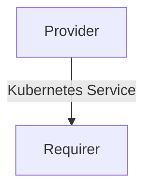

# `k8s-service`

## Usage

This relation interface describes the expected behavior of any charm claiming to be able to provide or consume a Kubernetes Service (k8s service). With K8s Service referring to the [Service abstraction](https://kubernetes.io/docs/concepts/services-networking/service/ ) defined in the Kubernetes API.

> #### ⚠️ SDI Deprecation
> The vast majority of charms using this interface are currently using serialized-data-interface. However this approach is deprecated and a new library will have to be implemented for any future usage.

## Direction
The `k8s-service` interface implements a provider/requirer pattern.
The requirer is a charm that wishes to consume a k8s service, and the provider is a charm able to provide it.



## Behavior

The requirer and the provider need to adhere to a certain set of criteria to be considered compatible with the interface.

### Provider

- Is expected to provide `service-name` and `service-port` needed to access the K8s service.
- Is expected to provide a `service-name` formatted as `<resource-name>.<namespace>`, for example `kfp-api.kubeflow`.

### Requirer

- Is expected to consume the data provided.

## Relation Data

### Provider

[\[JSON Schema\]](./schemas/provider.json)

Exposes a `url` field containing the url at which ingress is available. Should be placed in the **application** databag, encoded as yaml and nested in a "data" field.

#### Example

```yaml
application_data:
  service-name: "kfp-api.kubeflow",
  service-port: "8888",
```

### Requirer
N/A
