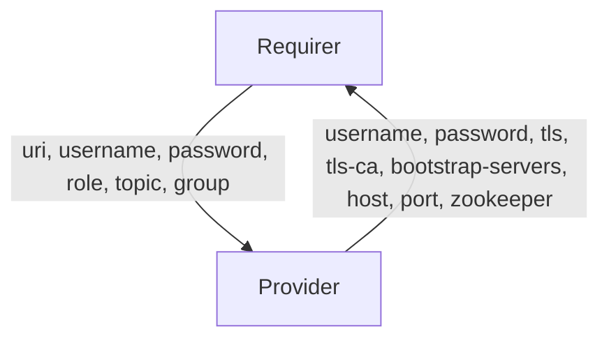

# `kafka`

## Usage

This relation interface describes the expected behavior of any charm claiming to be able to interface with a Kafka cluster as a client. For the majority of charms seeking to relate to a Kafka cluster, they will seek to do so either as a producer, consumer or admin client.

- Producers can expect their desired topic/wildcard to be granted WRITE, DESCRIBE, CREATE topic ACLs matching their application credentials upon relation. Producer clients then can create their own topics using whichever client-library they wish, setting any topic level configuration then (e.g `replication-factor` and `partitions`).
- Consumers can expect to be granted ACLs for a specified topic with READ, DESCRIBE on topic, and READ on consumer-group upon relation.
- Admins can expect to be granted super-user permissions for their application credentials upon relation.

## Direction



## Behavior

Both the Requirer and the Provider need to adhere to the criteria, to be considered compatible with the interface.

### Provider
- Is expected to create an application user and password inside the kafka cluster when the requirer provides the `username` or `password` fields. If any field is unset, one will be generated.
- Is expected to provide fields `tls` and `tls-ca` if TLS is configured.
- Is expected to provide the `bootstrap-servers` field with a comma-seperated list of broker uris, which can be used for cluster connection.
- Is expected to provide the `host` field with a comma-seperated list of broker IP addresses.
- Is expected to provide the `port` field with the shared broker port.
- Can optionally provide the `zookeeper` field with a comma-seperated list of ZooKeeper server uris and Kafka cluster zNode, if the requirer `role` is set to `admin`

### Requirer
- Is expected to provide an application host uri in the `uri` field.
- Can optionally provide an application username in the `username` field, if the charm would like a specific username.
- Can optionally provide an application password in the `password` field, if the charm would like a specific password.
- Can optionally provide the `role` field specifying the expected role of the client application (e.g `role=producer`, `role=consumer`, `role=admin`).
- Can optionally provide the `topic` field specifying the topic that the requirer charm needs permissions to create (for `role=producer`), or consume (for `role=consumer`). If `role` is set, this field is expected.
- Can optionally provide the desired consumer group for a requirer unit in the `group` field. If `role=consumer`, this field is expected.

## Relation Data

### Provider

[\[JSON Schema\]](./schemas/provider.json)

Provider provides application credentials and server connection uris. It should be placed in the **application** databag.


#### Example
```yaml
  relation-info:
  - endpoint: kafka
    related-endpoint: kafka
    application-data:
      username: user123
      password: Dy0k2UTfyNt2B13cfe412K7YGs07S4U7
      bootstrap-servers: 10.141.78.155:9092,10.141.78.62:9092,10.141.78.186:9092
      host: 10.141.78.155,10.141.78.62,10.141.78.186
      port: 9092

```

### Requirer

[\[JSON Schema\]](./schemas/requirer.json)

Requirer provides client connection uri, and optionally provides user-specified credentials, appliation role and topic. It should be placed in the **application** databag.
Requirer provides consumer group name if the requirer sets it's role as consumer. It should be placed in the **unit** databag.

#### Example

```yaml
  relation-info:
  - endpoint: kafka
    related-endpoint: kafka
    application-data:
        uri: 10.141.78.111:1234
        username: user123
        password: Dy0k2UTfyNt2B13cfe412K7YGs07S4U7 
        role: consumer
        topic: special-topic
    related-units:
        worker/0:
            in-scope: true
            data:
                group: group-A
        worker/1:
            in-scope: true
            data:
                group: group-B

```
