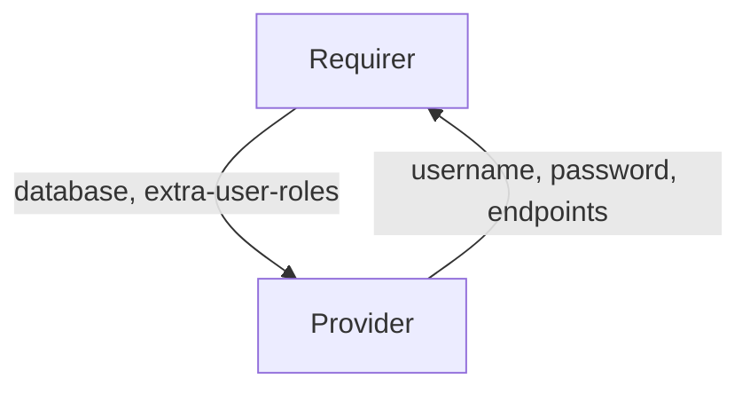

# `postgresql-client`

## Usage

This relation interface describes the expected behaviour of any charm claiming to be able to interact with a PostgreSQL database.
Our intent to have different interface names with `<database>-client` pattern (like `mongodb-client`) and the same validation rules for multiple databases (e.g. MySQL, PostgreSQL, MongoDB, etc).

In most cases, this will be accomplished using the database provider library, although charm developers are free to provide alternative libraries as long as they fulfil the behavioural and schematic requirements described in this document.

## Direction



As with all Juju relations, the `database` interface consists of two parties: a Provider (database charm), and a Requirer (application charm). The Requirer will be expected to provide a database name, and the Provider will provide new unique credentials (along with other optional fields), which can be used to access the actual database cluster.

## Behavior

Both the Requirer and the Provider need to adhere to criteria to be considered compatible with the interface.

### Provider
- Is expected to create an application user inside the database cluster when the requirer provides the `database` field.
- Is expected to provide `username` and `password` fields when Requirer provides the `database` field.
- Is expected to provide the `endpoints` field with has address of Primary, which can be used for Read/Write queries.
- Is expected to provide optional `read-only-endpoints` field with a comma-separated list of hosts or one Kubernetes Service, which can be used for Read-only queries.
- Is expected to provide the `version` field whenever database charm wants to communicate its database version.

### Requirer

- Is expected to provide a database name in the `database` field.
- Is expected to provide indentical values in the `database` field if several requirer units provide it in the relation.
- Is expected to have unique credentials for each relation. Therefore, different instances of the same Charm (juju applications) will have different relations with different credentials.
- Is expected to have different relations names on Requirer with the same interface name if Requirer needs access to multiple database charms.
- Is expected to allow multiple different Juju applications to access the same database name.
- Is expected to add any `extra-user-roles` provided by the Requirer to the created user (e.g. `extra-user-roles=admin`).

## Relation Data

### Provider

[\[JSON Schema\]](./schemas/provider.json)

Provider provides credentials, endpoints, TLS info and database-specific fields. It should be placed in the **application** databag.


#### Example
```yaml
  relation-info:
  - endpoint: database
    related-endpoint: database
    application-data:
      database: myappB
      endpoints: postgresql-k8s-primary:5432
      read-only-endpoints: postgresql-k8s-replicas:5432
      password: Dy0k2UTfyNt2B13cfe412K7YGs07S4U7
      username: relation-68
```

### Requirer

[\[JSON Schema\]](./schemas/requirer.json)

Requirer provides database name in `database` unit. Should be placed in the **unit** databag
in at least one unit of the Requirer.

#### Example

```yaml
  relation-info:
  - endpoint: database
    related-endpoint: database
    application-data: {}
    related-units:
      worker-a/0:
        in-scope: true
        data:
          database: myappA
```
