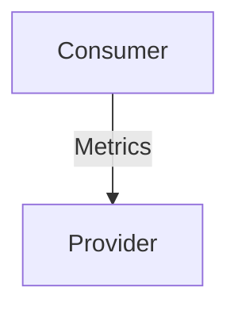

# `prometheus_remote_write`

## Usage

...

## Direction



As all Juju relations, the `prometheus_remote_write` interface consists of a provider and a consumer. One of these, in this case the `provider`, will be expected to stand up a remote write-compatible webserver where the `consumer` will be able to send it's metrics.

## Behavior

Both the consumer and the provider need to adhere to a certain set of criterias to be considered compatible with the interface.

### Provider

- Is expected to provide one or more endpoints for Prometheus remote write in the relation data bag.
- Is expected to be able to ingest alert rules exposed over the relation data bag.
- Is expected to respect the metrics topology set by the consumer.
- Is expected to inject alert rule topology labels as label matchers in alert rule expressions.
- Is expected not to inject juju_unit as a label matcher by default, but to honor it if hard-coded by the user.
- Is expected to be able to ingest both single alert rules and alert rule groups provided over the relation data bag.


### Consumer
- Is expected to be able to push Prometheus metrics to a remote write endpoint
- Is expected to fetch the target configuration from the relation data bag 
- Is expected to push all metrics to every remote write target available in the data bag.
- Is expected to provide alert rules over the relation data bag.
- Is expected to provide any wanted label matchers as labels on every alert rule in the relation data bag.
- Is expected to add any wanted topology labels to all metrics sent to the provider.
- Is expected to be able to expose both single alert rules and alert rule groups over the relation data bag

### Data Schema

```mermaid
...
```