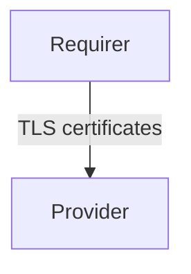

# `tls-certificates`

## Usage

This relation interface describes the expected behavior of any charm claiming to be able to provide 
or consume TLS certificates.

## Direction



As all Juju relations, the `tls-certificates` interface consists of a provider and a requirer. 
One of these, in this case the `provider`, will be expected to create TLS certificates where the 
`requirer` will be able to consume and use them for TLS communications.

## Behavior

Both the requirer and the provider need to adhere to a certain set of criteria to be considered 
compatible with the interface.


### Requirer
- Is expected to provide its unit name
- Is expected to provide the server common name
- Is expected to provide the server SAN's (Subject Alternative Names)
- Is expected to provide one or more certificate requests


### Provider
- Is expected to provide its CA certificate
- Is expected to provide its CA chain
- Is expected to provide certificates and private keys for each certificate request.


## Relation Data

### Requirer

[\[JSON Schema\]](./schemas/requirer.json)

The requirer specifies a set of client, server or application for which it requires certificates.


#### Example

```json
{
  "unit_name": "web-app-0",
  "sans": [
    "canonical.com"
  ],
  "cert_requests": [
    {
      "common_name": "abcd.canonical.com"
    }
  ]
}
```

### Provider

[\[JSON Schema\]](./schemas/provider.json)

The provider replies with certificates for each of the requested domain.

#### Example

```json
{
  "chain": "adefeaef",
  "ca": "aedafefewa",
  "abcd.canonical.com": {
    "key": "afaefawfawfawfaafe.key",
    "cert": "abavab.crt"
  }
}
```
